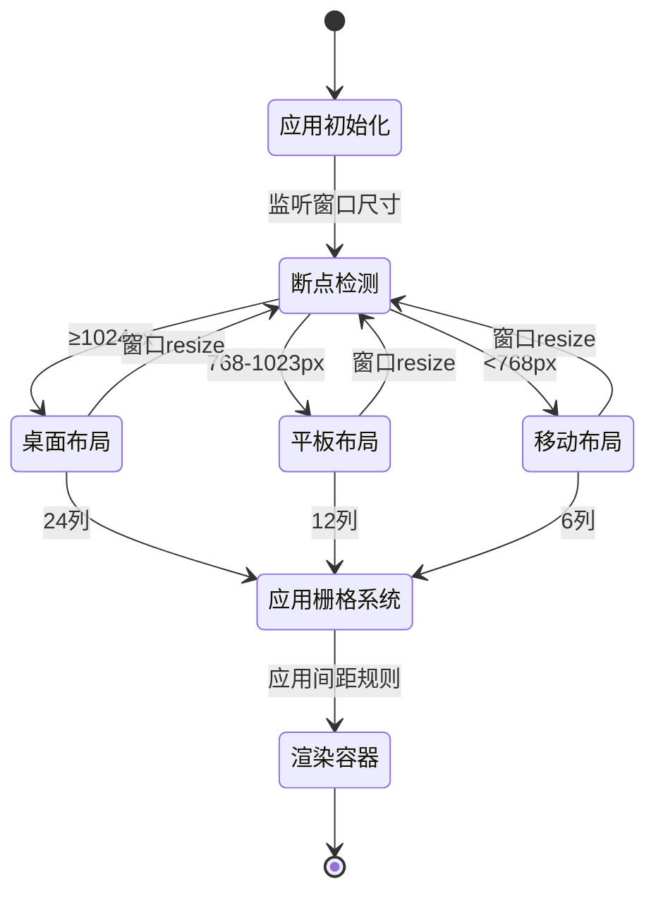

# UX 设计 — Implement responsive layout breakpoints and grid system

> 所属需求：响应式布局适配

## 交互流程图



**说明**：
- 应用启动时立即检测当前窗口宽度，确定初始断点
- 通过 `window.matchMedia` 监听断点变化，触发布局切换
- 每个断点对应不同的栅格列数和间距规则
- 容器组件根据断点应用不同的最大宽度和 padding
- 无用户主动操作，完全自动响应
```

## 组件线框说明

## 核心组件结构

### 1. ResponsiveContainer（响应式容器）
```
┌─────────────────────────────────────────┐
│ ResponsiveContainer                     │
│ ┌─────────────────────────────────────┐ │
│ │ [内容区域]                          │ │
│ │ - 桌面端：max-width 1440px 居中     │ │
│ │ - 平板端：100vw - 32px              │ │
│ │ - 移动端：100vw - 24px              │ │
│ └─────────────────────────────────────┘ │
└─────────────────────────────────────────┘
```
**属性**：
- `maxWidth`: number（默认 1440）
- `children`: ReactNode

### 2. 栅格系统配置
```
<Row gutter={{ xs: 8, sm: 12, md: 16, lg: 24 }}>
  <Col xs={6} sm={12} md={12} lg={8}>
    [内容块]
  </Col>
</Row>
```
**断点映射**：
- xs（<576px）：6 列可用
- sm（576-767px）：6 列可用
- md（768-1023px）：12 列可用
- lg（≥1024px）：24 列可用

### 3. 全局样式变量结构
```css
:root {
  /* 断点值 */
  --breakpoint-mobile: 768px;
  --breakpoint-tablet: 1024px;
  
  /* 容器宽度 */
  --container-max-width: 1440px;
  
  /* 响应式间距 */
  --spacing-desktop: 24px;
  --spacing-tablet: 16px;
  --spacing-mobile: 12px;
  
  /* 栅格间距 */
  --gutter-desktop: 24px;
  --gutter-tablet: 16px;
  --gutter-mobile: 8px;
}
```

### 4. Mixin 工具函数
```scss
@mixin mobile-only {
  @media (max-width: 767px) { @content; }
}

@mixin tablet-and-up {
  @media (min-width: 768px) { @content; }
}

@mixin desktop-only {
  @media (min-width: 1024px) { @content; }
}
```

## 交互状态定义

## 组件交互状态

### ResponsiveContainer 组件
- **桌面态（≥1024px）**：
  - 最大宽度：1440px
  - 水平居中：margin: 0 auto
  - 左右 padding：24px
  - 背景：透明（继承父容器）

- **平板态（768-1023px）**：
  - 宽度：100vw - 32px
  - 左右 padding：16px
  - 无最大宽度限制

- **移动态（<768px）**：
  - 宽度：100vw - 24px
  - 左右 padding：12px
  - 无最大宽度限制

- **过渡动画**：
  - 断点切换时：padding 和 max-width 使用 `transition: all 0.3s ease`
  - 防止布局抖动：`box-sizing: border-box`

### 栅格系统（Ant Design Row/Col）
- **默认态**：
  - 根据断点自动调整列数
  - gutter 间距响应式变化

- **加载态**：
  - 骨架屏占位：保持栅格结构
  - 每个 Col 内显示灰色占位块

- **空状态**：
  - 栅格结构保持
  - 内容区显示空状态提示

### 断点监听 Hook（useBreakpoint）
- **返回值**：
  - `{ isMobile: boolean, isTablet: boolean, isDesktop: boolean }`
  - `currentBreakpoint: 'mobile' | 'tablet' | 'desktop'`

- **监听状态**：
  - 初始化：立即返回当前断点
  - 窗口 resize：防抖 150ms 后更新
  - 卸载：清理 matchMedia 监听器

### 间距工具类（.p-responsive / .m-responsive）
- **桌面态**：padding/margin = 24px
- **平板态**：padding/margin = 16px
- **移动态**：padding/margin = 12px
- **过渡**：`transition: padding 0.3s ease, margin 0.3s ease`

## 响应式/适配规则

## 断点定义

### 三级断点系统
1. **移动端（Mobile）**：< 768px
   - 目标设备：iPhone SE (375px) ~ iPhone 14 Pro Max (430px)
   - 栅格列数：6 列
   - 容器 padding：12px
   - gutter 间距：8px

2. **平板端（Tablet）**：768px - 1023px
   - 目标设备：iPad (768px) ~ iPad Pro 11" (834px)
   - 栅格列数：12 列
   - 容器 padding：16px
   - gutter 间距：16px

3. **桌面端（Desktop）**：≥ 1024px
   - 目标设备：MacBook (1280px) ~ 4K 显示器 (1920px+)
   - 栅格列数：24 列
   - 容器最大宽度：1440px（居中）
   - 容器 padding：24px
   - gutter 间距：24px

## 布局规则

### 容器宽度
```
桌面端：min(100vw - 48px, 1440px) 居中
平板端：100vw - 32px
移动端：100vw - 24px
```

### 栅格配置
```jsx
<Row gutter={{ xs: 8, sm: 8, md: 16, lg: 24 }}>
  <Col xs={6} sm={6} md={12} lg={8}>
    // 移动端占满（6/6）
    // 平板端占满（12/12）
    // 桌面端占 1/3（8/24）
  </Col>
</Row>
```

### 媒体查询优先级
1. **Mobile-first 策略**：默认样式为移动端
2. **向上覆盖**：
   ```scss
   .element {
     padding: 12px; // 移动端默认
     
     @include tablet-and-up {
       padding: 16px; // 平板及以上
     }
     
     @include desktop-only {
       padding: 24px; // 仅桌面端
     }
   }
   ```

### 边界处理
- **767px → 768px**：从移动端切换到平板端
  - 栅格从 6 列变为 12 列
  - padding 从 12px 变为 16px
  - gutter 从 8px 变为 16px

- **1023px → 1024px**：从平板端切换到桌面端
  - 栅格从 12 列变为 24 列
  - padding 从 16px 变为 24px
  - gutter 从 16px 变为 24px
  - 容器应用最大宽度 1440px

### 防止布局抖动
- 所有容器：`box-sizing: border-box`
- 全局：`overflow-x: hidden`（防止水平滚动条）
- 过渡动画：`transition: padding 0.3s ease, max-width 0.3s ease`

### 测试设备尺寸
- 移动端：375px（iPhone SE）、390px（iPhone 14）、430px（iPhone 14 Pro Max）
- 平板端：768px（iPad）、834px（iPad Pro 11"）、1024px（iPad Pro 12.9"）
- 桌面端：1280px（MacBook）、1440px（标准显示器）、1920px（Full HD）

## UI 资产清单（初稿）

## UI 资产需求

### 图标（Icons）
暂无图标需求
[说明] 本工单为纯布局基础设施，不涉及可视化图标

### 插画（Illustrations）
暂无插画需求
[说明] 空状态插画由后续具体页面工单提供

### 图片（Images）
暂无图片需求

### 调试辅助资产（开发阶段临时使用）
- **断点指示器**（开发工具）
  - 类型：浮动标签组件
  - 内容：显示当前断点名称（Mobile/Tablet/Desktop）和窗口宽度
  - 位置：右下角固定定位
  - 样式：半透明背景 + 等宽字体
  - 用途：开发时实时查看断点状态
  - 生产环境：通过环境变量移除

- **栅格可视化覆盖层**（开发工具）
  - 类型：半透明网格叠加层
  - 内容：显示当前断点的栅格列（6/12/24 列）
  - 颜色：rgba(255, 0, 0, 0.1) 列背景 + rgba(0, 0, 255, 0.2) gutter
  - 触发：按 `Ctrl+Shift+G` 切换显示
  - 用途：验证栅格对齐
  - 生产环境：完全移除

## 后续工单可能需要的资产

### 移动端导航相关（未来需求）
- icon: menu-hamburger（汉堡菜单，24x24px，outline 风格）
- icon: close（关闭菜单，24x24px，outline 风格）
- icon: chevron-down（展开子菜单，16x16px）

### 平板端侧边栏相关（未来需求）
- icon: sidebar-collapse（收起侧边栏，20x20px）
- icon: sidebar-expand（展开侧边栏，20x20px）

### 空状态插画（未来需求）
- illustration: empty-list-mobile（移动端优化版，宽度 ≤ 300px）
- illustration: empty-list-desktop（桌面端版本，宽度 400-500px）

[假设] 以上资产需求将在后续响应式组件开发工单中明确，本工单仅搭建布局框架。
