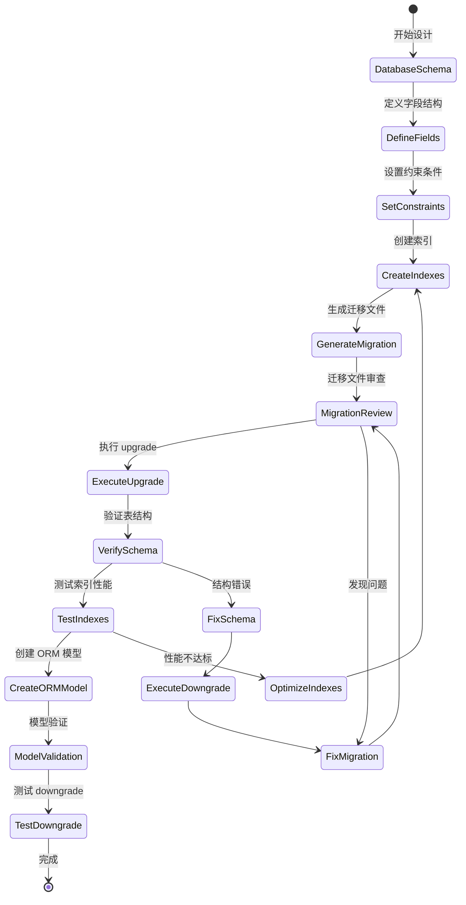

# UX 设计 — Design transaction data model and database schema

> 所属需求：收支记录管理（核心功能）

## 交互流程图


```

## 组件线框说明

## 数据库表结构（transactions）

### 主要字段分组

**1. 标识字段区**
- id (主键)
- user_id (外键)

**2. 核心业务字段区**
- type (收支类型枚举)
- amount (金额)
- category_id (分类外键)
- date (记账日期)

**3. 扩展信息字段区**
- note (备注文本)
- payment_method (支付方式)

**4. 系统字段区**
- created_at (创建时间)
- updated_at (更新时间)

---

## 迁移文件结构

### Alembic 迁移脚本组件

**1. 文件头部**
- Revision ID
- Revises (上一版本)
- Create Date
- 描述信息

**2. upgrade() 方法**
- 创建表语句
- 字段定义
- 约束定义
- 索引创建

**3. downgrade() 方法**
- 删除索引
- 删除表

---

## SQLAlchemy 模型类结构

### Transaction 模型组件

**1. 类定义区**
- __tablename__
- __table_args__ (索引定义)

**2. 字段映射区**
- Column 定义（10个字段）
- 类型映射（Integer, String, Numeric, Date, DateTime, Enum）

**3. 关系定义区**
- relationship('User')
- relationship('Category')

**4. 验证方法区**
- @validates('amount')
- @validates('type')

**5. 辅助方法区**
- __repr__()
- to_dict()

## 交互状态定义

## 数据库迁移操作状态

### alembic upgrade 命令
- **执行中 (running)**: 显示迁移进度日志，逐步执行 SQL 语句
- **成功 (success)**: 输出 "Running upgrade -> [revision_id], create_transactions_table"，返回码 0
- **失败 (error)**: 输出错误堆栈，指出失败的 SQL 语句，返回码非 0
- **回滚 (rollback)**: 自动回滚已执行的部分语句，保持数据库一致性

### alembic downgrade 命令
- **执行中 (running)**: 显示回退进度日志
- **成功 (success)**: 输出 "Running downgrade [revision_id] -> [previous_id]"，表被删除
- **失败 (error)**: 输出错误信息（如外键约束阻止删除）

### 数据库表状态
- **不存在 (not_exists)**: 迁移前状态，查询表返回 "relation does not exist"
- **创建中 (creating)**: 执行 CREATE TABLE 语句期间
- **已创建 (created)**: 表结构完整，可执行 INSERT/SELECT 操作
- **索引构建中 (indexing)**: CREATE INDEX 语句执行期间（大表可能耗时较长）
- **已优化 (optimized)**: 所有索引创建完成，EXPLAIN 显示使用索引

### ORM 模型验证状态
- **定义正确 (valid)**: 模型字段与数据库表结构一致
- **类型不匹配 (type_mismatch)**: Python 类型与数据库类型映射错误（如 Integer 映射到 VARCHAR）
- **约束缺失 (constraint_missing)**: 模型未定义 nullable=False 但数据库有 NOT NULL 约束
- **关系错误 (relationship_error)**: 外键关系配置错误，查询时抛出 AttributeError

### 数据插入验证状态
- **校验通过 (validated)**: amount > 0, type in ['income', 'expense']，数据成功插入
- **金额错误 (amount_invalid)**: amount <= 0，触发 ValueError 或数据库 CHECK 约束
- **类型错误 (type_invalid)**: type 不在枚举值中，数据库拒绝插入
- **外键错误 (foreign_key_error)**: user_id 或 category_id 不存在，触发 IntegrityError
- **长度超限 (length_exceeded)**: note 超过 500 字符，数据库返回 DataError

### 索引性能状态
- **未使用索引 (no_index)**: EXPLAIN 显示 type=ALL（全表扫描）
- **使用索引 (index_used)**: EXPLAIN 显示 type=index 或 type=ref
- **索引失效 (index_ineffective)**: 查询条件导致索引无法使用（如 OR 条件、函数包裹字段）
- **索引优化完成 (optimized)**: 复合索引覆盖查询，Extra 显示 "Using index"

## 响应式/适配规则

## 数据库设计响应式规则

### 数据量级适配

**小规模（< 10万条记录）**
- 使用基础索引：主键 + (user_id, date DESC)
- 单表查询性能 < 100ms

**中等规模（10万 - 100万条）**
- 添加复合索引：(user_id, type, date DESC) + (category_id)
- 分页查询必须使用 LIMIT + OFFSET
- 统计查询使用索引覆盖扫描

**大规模（> 100万条）**
- 考虑分区表：按 date 字段分区（按月或按年）
- 归档历史数据：超过 2 年的记录移至归档表
- 使用物化视图缓存统计结果

---

### 字段长度适配

**note 字段**
- Mobile: 建议限制 200 字符（前端输入框提示）
- Tablet/Desktop: 允许 500 字符（数据库硬限制）

**payment_method 字段**
- 预设值列表：现金/支付宝/微信支付/银行卡/信用卡
- 自定义值：最长 50 字符

---

### 精度适配

**amount 字段**
- 标准精度：DECIMAL(10,2) - 支持 99,999,999.99
- 高精度需求（加密货币）：DECIMAL(18,8)
- 显示格式：前端根据 locale 格式化（¥1,234.56 / $1,234.56）

---

### 索引策略适配

**查询模式 1：按用户查询最近记录**
- 索引：(user_id, date DESC)
- 适用场景：首页展示最近 20 条记录

**查询模式 2：按分类统计**
- 索引：(category_id)
- 适用场景：分类支出占比饼图

**查询模式 3：按类型筛选**
- 索引：(user_id, type, date DESC)
- 适用场景：仅查看收入或支出记录

---

### 时区处理

**created_at / updated_at**
- 数据库存储：UTC 时间（TIMESTAMP WITHOUT TIME ZONE）
- 应用层转换：根据用户时区显示本地时间

**date 字段**
- 存储：DATE 类型（无时区信息）
- 语义：用户所在时区的日期（2024-01-15 表示用户当地的 1 月 15 日）

## UI 资产清单（初稿）

## 图标资产（Icons）

**数据库相关**
- icon: database（数据库表示，24px，outline 风格）
- icon: table（表结构图标，24px，outline 风格）
- icon: index（索引图标，20px，outline 风格）
- icon: key（主键/外键图标，20px，solid 风格）

**状态指示**
- icon: check-circle（成功状态，24px，solid 风格，绿色）
- icon: x-circle（错误状态，24px，solid 风格，红色）
- icon: alert-triangle（警告状态，24px，outline 风格，黄色）
- icon: loader（加载中动画，24px，spinning）

**操作类**
- icon: play（执行迁移，20px，solid 风格）
- icon: rotate-ccw（回滚迁移，20px，outline 风格）
- icon: refresh（重新加载，20px，outline 风格）
- icon: code（查看 SQL，20px，outline 风格）

---

## 插画资产（Illustrations）

**空状态**
- illustration: empty-database（数据库为空时显示，400x300，扁平风格，灰蓝色调）
  - 描述：一个空的数据库图标 + "暂无数据表" 文字

**错误状态**
- illustration: migration-failed（迁移失败时显示，400x300，扁平风格）
  - 描述：断裂的数据库连接线 + 错误符号

**成功状态**
- illustration: migration-success（迁移成功时显示，300x200，扁平风格，绿色调）
  - 描述：数据库图标 + 向上箭头 + 勾选标记

---

## 图表资产（Diagrams）

**ER 图**
- diagram: transactions-er-diagram（实体关系图，SVG 格式，可缩放）
  - 内容：transactions 表与 users、categories 表的关系
  - 显示：字段名、数据类型、主外键关系线

**索引结构图**
- diagram: index-structure（B-Tree 索引示意图，PNG，800x400）
  - 内容：展示复合索引 (user_id, date DESC) 的树状结构

---

## 代码片段资产（Code Snippets）

**SQL 示例**
- code: create-table-sql（CREATE TABLE 语句，语法高亮）
- code: create-index-sql（CREATE INDEX 语句，语法高亮）

**Python 示例**
- code: sqlalchemy-model（Transaction 模型类定义，语法高亮）
- code: alembic-migration（迁移文件模板，语法高亮）

---

## 文档资产（Documentation）

**字段说明表格**
- table: field-definitions（字段定义表格，Markdown 格式）
  - 列：字段名 | 类型 | 约束 | 说明 | 示例值

**索引性能对比表**
- table: index-performance（索引性能对比，Markdown 格式）
  - 列：查询类型 | 无索引耗时 | 有索引耗时 | 优化比例

---

## 日志输出资产（Log Examples）

**成功日志**
- log: upgrade-success（alembic upgrade 成功输出，等宽字体）
  ```
  INFO  [alembic.runtime.migration] Running upgrade  -> a1b2c3d4e5f6, create_transactions_table
  ```

**错误日志**
- log: constraint-error（外键约束错误输出，等宽字体，红色）
  ```
  ERROR [sqlalchemy.exc.IntegrityError] FOREIGN KEY constraint failed
  ```
