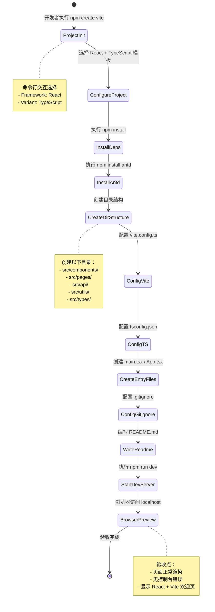

# UX 设计 — Initialize Vite + React + TypeScript project scaffold

> 所属需求：前端项目基础架构搭建

## 交互流程图


```

## 组件线框说明

## 项目目录结构（线框）

```
project-root/
├── src/
│   ├── components/          # 公共组件目录
│   │   └── .gitkeep        # 占位文件
│   ├── pages/              # 页面目录
│   │   └── Home.tsx        # 示例首页
│   ├── api/                # API 接口层
│   │   └── .gitkeep
│   ├── utils/              # 工具函数
│   │   └── .gitkeep
│   ├── types/              # TypeScript 类型定义
│   │   └── index.ts        # 全局类型导出
│   ├── App.tsx             # 根组件
│   ├── main.tsx            # 应用入口
│   └── vite-env.d.ts       # Vite 类型声明
├── public/                 # 静态资源
├── vite.config.ts          # Vite 配置
├── tsconfig.json           # TypeScript 配置
├── tsconfig.node.json      # Node 环境 TS 配置
├── package.json            # 依赖清单
├── .gitignore              # Git 忽略规则
└── README.md               # 项目文档
```

## 核心文件内容结构

### main.tsx（应用入口）
- 导入 React 核心库
- 导入 Ant Design 样式重置文件
- 导入根组件 App
- 挂载到 #root DOM 节点

### App.tsx（根组件）
- 顶层容器组件
- 包含示例页面引用
- 预留路由配置位置（注释说明）

### vite.config.ts（构建配置）
- server.port: 开发服务器端口
- resolve.alias: 路径别名 @/ -> /src
- plugins: React 插件配置
- build: 构建优化选项

### tsconfig.json（类型配置）
- compilerOptions.strict: true
- compilerOptions.paths: @/* 映射
- compilerOptions.jsx: react-jsx
- include: src 目录

### README.md（文档结构）
- 项目简介
- 技术栈说明
- 快速开始（安装依赖 + 启动命令）
- 目录结构说明
- 开发规范（预留）

## 交互状态定义

## 命令行交互状态

### npm create vite 命令
- **执行中**：显示 Vite 版本信息 + 项目名称输入提示
- **选择框架**：列表选项（React / Vue / Svelte 等），高亮当前选项
- **选择变体**：列表选项（TypeScript / JavaScript），高亮当前选项
- **完成**：输出「Scaffolding project in...」+ 后续操作提示

### npm install 命令
- **默认**：显示「Installing dependencies...」
- **进行中**：进度条 + 已安装包数量 / 总数
- **完成**：输出「added XXX packages」+ 耗时
- **错误**：红色错误信息 + 堆栈跟踪（网络错误 / 版本冲突）

### npm run dev 命令
- **启动中**：显示「VITE vX.X.X ready in XXX ms」
- **成功**：输出本地访问地址（绿色高亮）+ 网络地址
- **端口占用**：提示端口被占用 + 自动切换到下一个可用端口
- **编译错误**：红色错误信息 + 文件路径 + 行号

## 浏览器页面状态

### 开发服务器首页
- **加载中**：白屏（< 100ms，无需 loading）
- **正常显示**：
  - Vite + React Logo（居中）
  - 标题文字「Vite + React」
  - 计数器按钮（可点击）
  - 底部提示文字
- **热更新**：修改代码后页面局部刷新（无闪烁）
- **编译错误**：页面覆盖层显示错误信息（红色背景 + 错误堆栈）

### 计数器按钮（示例组件）
- **默认**：蓝色背景，显示「count is 0」
- **hover**：背景色加深 10%
- **active**：scale(0.98) + 背景色加深 20%
- **点击后**：数字递增，无延迟

## 文件系统状态

### 目录创建
- **成功**：目录存在且包含 .gitkeep 或示例文件
- **失败**：权限不足 / 磁盘空间不足（抛出异常）

### 配置文件写入
- **成功**：文件存在且内容符合预期格式
- **冲突**：文件已存在时不覆盖（需手动确认）
- **语法错误**：JSON / TS 配置文件格式错误时 IDE 显示红色波浪线

## 响应式/适配规则

## 响应式适配规则

### 断点定义
本项目为**开发环境脚手架**，不涉及最终用户界面，因此响应式规则仅适用于**开发者预览页面**（Vite 默认欢迎页）。

- **Mobile**: < 768px（不适用，开发环境通常在桌面端）
- **Tablet**: 768px - 1024px（不适用）
- **Desktop**: > 1024px（主要适配目标）

### 开发服务器欢迎页适配

#### Desktop（> 1024px）
- Logo 尺寸：120px x 120px
- 标题字号：32px
- 计数器按钮：padding 16px 32px
- 页面最大宽度：1200px，居中显示
- 左右边距：24px

#### Tablet（768px - 1024px）
- Logo 尺寸：100px x 100px
- 标题字号：28px
- 计数器按钮：padding 14px 28px
- 页面最大宽度：100%
- 左右边距：16px

#### Mobile（< 768px）
- Logo 尺寸：80px x 80px
- 标题字号：24px
- 计数器按钮：padding 12px 24px
- 页面最大宽度：100%
- 左右边距：12px

### 浏览器兼容性
- **Chrome**: >= 90（主要开发浏览器）
- **Firefox**: >= 88
- **Safari**: >= 14
- **Edge**: >= 90
- **不支持**: IE 11 及以下

### 开发工具适配
- **VSCode 终端**：输出信息自动换行，宽度适配终端窗口
- **浏览器 DevTools**：控制台日志正常显示，无截断
- **命令行终端**：彩色输出在支持 ANSI 的终端正常显示

### 特殊说明
本工单产出为**技术基础设施**，不包含业务页面，因此响应式规则主要用于：
1. 确保开发服务器欢迎页在不同屏幕尺寸下可正常预览
2. 为后续业务页面开发提供断点参考
3. 实际业务页面的响应式实现在后续工单中完成

## UI 资产清单（初稿）

## UI 资产清单

### 图标（Icons）
本工单**不需要自定义图标**，使用 Vite 和 React 官方 Logo 即可。

- **vite-logo**: Vite 官方 Logo（SVG 格式，已包含在 Vite 模板中）
  - 用途：开发服务器欢迎页顶部展示
  - 尺寸：120x120px（Desktop）
  - 风格：渐变色（紫色到黄色）
  - 来源：`/public/vite.svg`

- **react-logo**: React 官方 Logo（SVG 格式，已包含在 Vite 模板中）
  - 用途：开发服务器欢迎页顶部展示（与 Vite Logo 并列）
  - 尺寸：120x120px（Desktop）
  - 风格：蓝色原子图标 + 旋转动画
  - 来源：`/src/assets/react.svg`

### 插画（Illustrations）
本工单**不需要插画**，为纯技术基础设施搭建。

### 图片（Images）
本工单**不需要图片资源**。

### 字体（Fonts）
使用系统默认字体栈，无需额外字体文件：
```css
font-family: -apple-system, BlinkMacSystemFont, 'Segoe UI', Roboto, 
             'Helvetica Neue', Arial, sans-serif;
```

### 颜色（Colors）
虽然本工单不涉及视觉样式定制，但需确保以下颜色在代码中可用（Vite 默认主题）：
- **Primary**: #646cff（Vite 主题色）
- **React Blue**: #61dafb（React Logo 颜色）
- **Background**: #242424（深色模式背景）
- **Text**: rgba(255, 255, 255, 0.87)（深色模式文字）

### 动画资源（Animations）
- **React Logo 旋转动画**：已包含在 Vite 模板的 CSS 中（`@keyframes logo-spin`）
  - 用途：React Logo 持续旋转效果
  - 时长：20s 无限循环
  - 缓动：linear

### Favicon
- **favicon.svg**: Vite 官方 Favicon（已包含在模板中）
  - 用途：浏览器标签页图标
  - 尺寸：32x32px
  - 来源：`/public/vite.svg`（浏览器自动缩放）

---

## 资产获取说明
所有 UI 资产均由 **Vite 官方模板自动生成**，无需手动下载或创建。执行 `npm create vite@latest` 后，以下文件会自动包含：
- `/public/vite.svg`
- `/src/assets/react.svg`
- `/src/App.css`（包含 Logo 动画）
- `/src/index.css`（包含全局样式）

## 后续工单资产需求
以下资产将在后续业务功能开发时提供：
- 业务页面图标（导航、操作按钮等）
- 空状态插画
- 错误状态插画
- 品牌 Logo（如有）
- 自定义字体（如有品牌要求）
