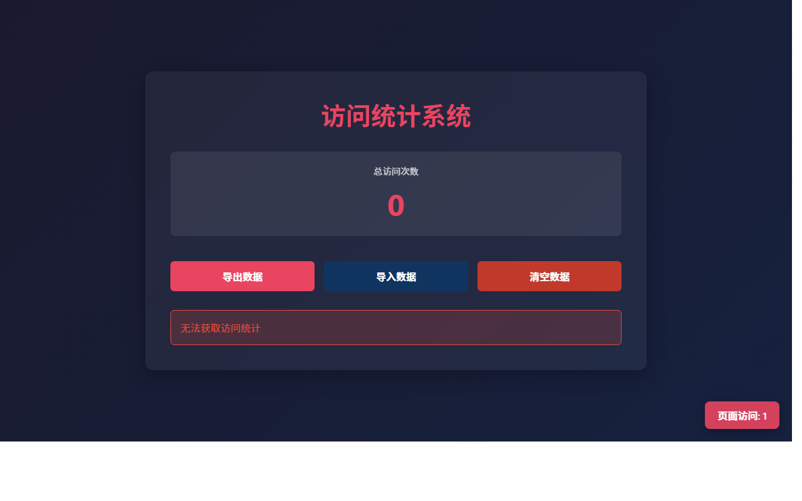

# 产品验收 — Design category icon set and color palette

## 结果: ❌ 不通过

| 项目 | 值 |
|------|------|
| 评分 | 2/10 (通过线: 6) |
| 状态 | acceptance_rejected |

## 反馈
根据截图，当前页面显示的是一个「访问统计系统」，显示总访问次数为0，包含「导出数据」、「导入数据」、「清空数据」三个按钮，以及「无法获取访问统计」的提示信息。这与需求描述完全不符。需求要求设计分类图标集合（至少20个常用图标，如食物、交通、购物等）和配色方案，应该展示图标设计和配色方案的页面或文档，而不是访问统计系统。截图中没有看到任何图标设计、SVG 图标展示、配色方案或无障碍对比度相关的内容。

## 检查清单
  1. 页面能否正常打开
  2. 功能是否符合需求描述
  3. 界面是否美观合理

## 运行效果截图

## 问题
- 截图显示的是访问统计系统，与需求描述的图标设计和配色方案完全无关
- 未看到任何分类图标（食物、交通、购物、娱乐、健康等）的展示
- 未看到配色方案的展示或说明
- 未看到 SVG 格式图标的呈现
- 未看到无障碍对比度标准的相关信息
- 页面功能（导出/导入/清空数据）与设计需求不匹配
