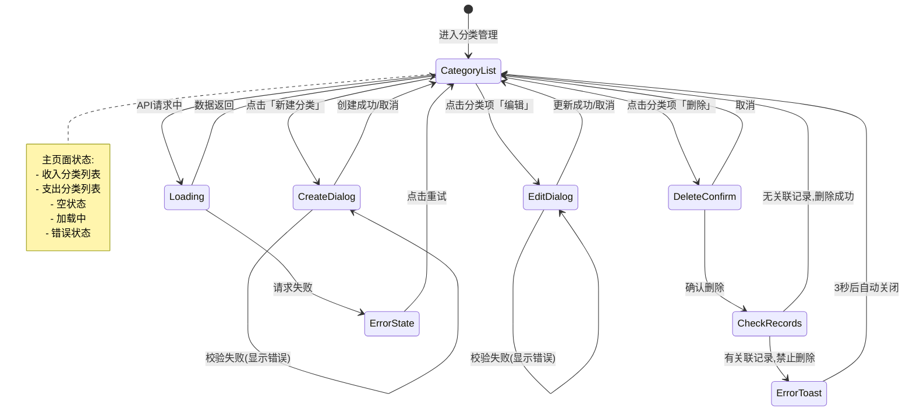

# UX 设计 — Implement category CRUD API endpoints

> 所属需求：分类管理系统

## 交互流程图


```

## 组件线框说明

## 主页面结构 (CategoryList)

```
┌─────────────────────────────────────┐
│ Header                              │
│  ├─ 标题: 分类管理                  │
│  └─ 操作: [+ 新建分类] 按钮         │
├─────────────────────────────────────┤
│ Tab 切换器                          │
│  ├─ [支出] (默认选中)               │
│  └─ [收入]                          │
├─────────────────────────────────────┤
│ 分类列表区域                        │
│  ┌───────────────────────────────┐  │
│  │ 分类项 Card                   │  │
│  │  ├─ 图标 (左侧)               │  │
│  │  ├─ 分类名称 (中间)           │  │
│  │  └─ 操作按钮组 (右侧)         │  │
│  │      ├─ [编辑] IconButton    │  │
│  │      └─ [删除] IconButton    │  │
│  └───────────────────────────────┘  │
│  (重复多个分类项)                   │
└─────────────────────────────────────┘
```

## 创建/编辑弹窗 (Dialog)

```
┌─────────────────────────────────────┐
│ 弹窗标题: 新建分类 / 编辑分类       │
├─────────────────────────────────────┤
│ 表单区域                            │
│  ├─ 分类名称 (必填)                 │
│  │   └─ Input: placeholder="请输入" │
│  │   └─ 错误提示区域 (动态显示)     │
│  ├─ 分类类型 (必选)                 │
│  │   └─ Radio Group: 支出/收入      │
│  └─ 图标选择 (可选)                 │
│      └─ IconPicker 组件             │
├─────────────────────────────────────┤
│ 底部操作栏                          │
│  ├─ [取消] 次要按钮                 │
│  └─ [确定] 主要按钮                 │
└─────────────────────────────────────┘
```

## 删除确认弹窗 (ConfirmDialog)

```
┌─────────────────────────────────────┐
│ ⚠️ 警告图标                         │
│ 确认删除「{分类名称}」？            │
│                                     │
│ 提示文字: 删除后无法恢复            │
├─────────────────────────────────────┤
│ [取消] 次要按钮  [确定删除] 危险按钮│
└─────────────────────────────────────┘
```

## 空状态组件 (EmptyState)

```
┌─────────────────────────────────────┐
│         📂 插画占位                 │
│                                     │
│      暂无{收入/支出}分类            │
│   点击右上角按钮创建第一个分类      │
└─────────────────────────────────────┘
```

## 交互状态定义

## 主要按钮 (新建分类按钮)
- **normal**: 主色背景，白色文字，圆角
- **hover**: 背景亮度 +10%
- **active**: scale(0.95)，背景亮度 -5%
- **disabled**: opacity 0.5，cursor not-allowed
- **loading**: 显示 spinner，文字变为「创建中...」，禁止点击

## 分类项卡片
- **normal**: 白色背景，边框 1px 灰色
- **hover**: 背景色变为浅灰 (#f5f5f5)
- **selected**: 无选中状态（非多选场景）
- **loading**: 骨架屏占位（首次加载）
- **empty**: 显示空状态组件

## 编辑/删除图标按钮
- **normal**: 灰色图标，透明背景
- **hover**: 图标变为主色，背景浅色圆形
- **active**: scale(0.9)
- **disabled**: opacity 0.3，不可点击

## 输入框 (分类名称)
- **default**: 边框 #d9d9d9，placeholder 浅灰
- **focus**: 边框变为主色，显示光标
- **filled**: 文字颜色变深 (#000)
- **error**: 边框红色 (#ff4d4f)，下方显示错误文字「分类名称不能为空」
- **success**: 边框绿色 (#52c41a)，右侧显示 ✓ 图标
- **disabled**: 背景 #f5f5f5，不可编辑

## Radio 单选组 (分类类型)
- **unchecked**: 空心圆圈，灰色边框
- **checked**: 实心圆点，主色填充
- **hover**: 边框颜色加深
- **disabled**: opacity 0.4

## 弹窗 (Dialog)
- **entering**: 从底部向上滑动 200ms + fade in
- **exiting**: fade out 150ms
- **backdrop**: 半透明黑色遮罩 (rgba(0,0,0,0.45))

## Tab 切换器
- **inactive**: 灰色文字，无下划线
- **active**: 主色文字，底部 2px 主色下划线
- **hover**: 文字颜色加深
- **switching**: 下划线滑动动画 200ms

## Toast 提示
- **success**: 绿色背景，白色文字，✓ 图标，从顶部滑入
- **error**: 红色背景，白色文字，✗ 图标，从顶部滑入
- **duration**: 停留 3s 后自动 fade out 500ms

## 页面级状态
- **loading**: 骨架屏显示 3-5 个分类项占位
- **empty**: 空状态插画 + 引导文案
- **error**: 显示错误图标 + 「加载失败，请重试」+ [重试] 按钮

## 响应式/适配规则

## 断点定义
- **mobile**: < 768px
- **tablet**: 768px - 1024px
- **desktop**: > 1024px

## Mobile (< 768px)
- Header 标题居中，新建按钮改为右上角 + 图标
- Tab 切换器占满宽度，每个 tab 50%
- 分类项卡片：
  - 单列布局
  - 图标 32px
  - 操作按钮垂直排列（编辑在上，删除在下）
- 弹窗：
  - 全屏显示（高度 100vh）
  - 从底部滑入
  - 表单字段垂直堆叠
- 删除确认弹窗：居中显示，宽度 90vw，最大 400px

## Tablet (768px - 1024px)
- Header 标题左对齐，新建按钮显示完整文字
- 分类项卡片：
  - 双列网格布局（grid-template-columns: 1fr 1fr）
  - 间距 16px
  - 图标 40px
- 弹窗：
  - 居中显示，宽度 600px
  - 从中心 fade + scale(0.9 → 1)
- 操作按钮水平排列

## Desktop (> 1024px)
- Header 标题左对齐，新建按钮右对齐
- 分类项卡片：
  - 三列网格布局（grid-template-columns: repeat(3, 1fr)）
  - 间距 24px
  - 图标 48px
  - hover 效果明显（阴影 + 背景色变化）
- 弹窗：
  - 居中显示，宽度 720px
  - 表单字段可能横向排列（如分类类型 Radio 横向）
- 删除确认弹窗：宽度固定 480px

## 通用规则
- 所有触摸目标最小 44x44px（移动端）
- 弹窗最大高度 90vh，内容超出时滚动
- Toast 在移动端宽度 90vw，桌面端固定 400px
- 骨架屏动画：shimmer 效果，1.5s 循环

## UI 资产清单（初稿）

## 图标 (Icons)
- **icon: plus** - 新建分类按钮，24px，filled 风格，白色
- **icon: edit** - 编辑按钮，20px，outline 风格，灰色/主色
- **icon: delete** - 删除按钮，20px，outline 风格，灰色/红色
- **icon: close** - 关闭弹窗，24px，outline 风格，灰色
- **icon: check** - 成功提示/校验通过，20px，filled 风格，绿色
- **icon: warning** - 删除确认警告，48px，filled 风格，橙色
- **icon: error** - 错误提示，20px，filled 风格，红色
- **icon: loading** - 加载 spinner，24px，动画旋转，主色
- **icon: arrow-left** - 移动端返回按钮，24px，outline 风格
- **icon: refresh** - 重试按钮，24px，outline 风格

## 分类图标集 (Category Icons)
- **icon-set: category-icons** - 用户可选的分类图标，包含：
  - 餐饮：restaurant, coffee, fastfood (24px, outline)
  - 交通：car, bus, subway (24px, outline)
  - 购物：shopping-cart, gift, clothes (24px, outline)
  - 娱乐：movie, game, music (24px, outline)
  - 居住：home, water, electricity (24px, outline)
  - 医疗：hospital, medicine (24px, outline)
  - 收入：salary, bonus, investment (24px, outline)
  - 其他：more, custom (24px, outline)

## 插画 (Illustrations)
- **illustration: empty-category** - 分类列表为空状态，描述：简约风格文件夹图标 + 虚线边框，尺寸 200x200px，SVG 格式，灰色调
- **illustration: error-state** - 加载失败状态，描述：断开的链接图标 + 云朵，尺寸 240x180px，SVG 格式，灰色调

## 图片 (Images)
- 无需额外图片资源（纯图标+插画方案）

## 动画资源 (Animations)
- **animation: shimmer** - 骨架屏加载动画，CSS gradient 实现，从左到右扫光效果
- **animation: slide-up** - 弹窗从底部滑入，CSS transform translateY(100% → 0)
- **animation: fade-scale** - 弹窗居中出现，CSS opacity(0 → 1) + scale(0.9 → 1)
- **animation: toast-slide** - Toast 从顶部滑入，CSS transform translateY(-100% → 0)

## 颜色语义（仅供参考，非视觉设计）
- 主色：primary（按钮、选中状态、链接）
- 成功：success / green（校验通过、操作成功）
- 警告：warning / orange（删除确认）
- 错误：error / red（校验失败、操作失败）
- 中性：gray（边框、禁用状态、次要文字）
