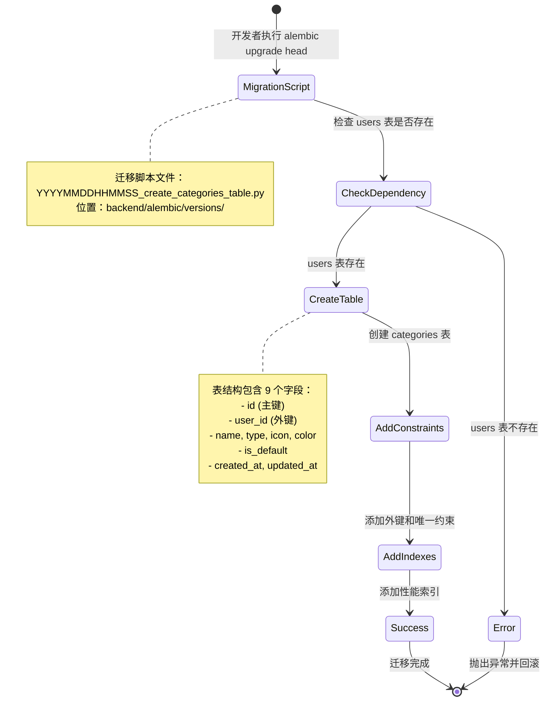

# UX 设计 — Create categories database table and migration

> 所属需求：分类管理系统

## 交互流程图


```

## 组件线框说明

## 数据库表结构（非 UI 组件）

### categories 表结构
```
+----------------+------------------+-------------+
| 字段名          | 数据类型          | 约束         |
+----------------+------------------+-------------+
| id             | INTEGER          | PRIMARY KEY |
|                |                  | AUTOINCREMENT|
+----------------+------------------+-------------+
| user_id        | INTEGER          | NOT NULL    |
|                |                  | FOREIGN KEY |
+----------------+------------------+-------------+
| name           | VARCHAR(50)      | NOT NULL    |
+----------------+------------------+-------------+
| type           | ENUM             | NOT NULL    |
|                | (income/expense) |             |
+----------------+------------------+-------------+
| icon           | VARCHAR(50)      | NULL        |
+----------------+------------------+-------------+
| color          | VARCHAR(7)       | DEFAULT     |
|                |                  | '#000000'   |
+----------------+------------------+-------------+
| is_default     | BOOLEAN          | DEFAULT     |
|                |                  | FALSE       |
+----------------+------------------+-------------+
| created_at     | DATETIME         | DEFAULT NOW |
+----------------+------------------+-------------+
| updated_at     | DATETIME         | AUTO UPDATE |
+----------------+------------------+-------------+
```

### 索引结构
- **idx_user_type**: 复合索引 (user_id, type) - 用于按用户和类型筛选查询
- **idx_user_id**: 单列索引 (user_id) - 用于用户维度查询

### 约束结构
- **uq_user_name_type**: UNIQUE(user_id, name, type) - 防止重复分类
- **fk_user_id**: FOREIGN KEY(user_id) REFERENCES users(id) ON DELETE CASCADE

### 迁移脚本结构
```
backend/
└── alembic/
    └── versions/
        └── YYYYMMDDHHMMSS_create_categories_table.py
            ├── upgrade()    # 创建表、索引、约束
            └── downgrade()  # 删除表
```

## 交互状态定义

## 数据库迁移脚本状态（非交互式组件）

### 迁移执行状态
- **待执行（pending）**：迁移脚本已创建但未执行
  - 状态标识：alembic history 显示为 "(head)"
  - 数据库无 categories 表

- **执行中（running）**：alembic upgrade 命令正在执行
  - 终端显示："Running upgrade ... -> ..., create categories table"
  - 数据库处于事务中

- **执行成功（success）**：迁移完成
  - 终端显示："INFO [alembic.runtime.migration] Running upgrade ... -> ..., create categories table"
  - alembic_version 表记录新版本号
  - categories 表存在且包含所有字段和索引

- **执行失败（error）**：迁移过程中出错
  - 终端显示错误堆栈
  - 数据库自动回滚（事务特性）
  - alembic_version 表保持旧版本号
  - 常见错误：
    - users 表不存在（外键依赖缺失）
    - 表已存在（重复执行）
    - 权限不足（数据库用户权限问题）

- **已回滚（downgraded）**：执行 alembic downgrade 后
  - categories 表被删除
  - alembic_version 表回退到前一版本

### 数据库约束状态
- **外键约束生效**：
  - 插入不存在的 user_id 时抛出 IntegrityError
  - 删除 users 表记录时级联删除 categories 记录

- **唯一约束生效**：
  - 插入重复 (user_id, name, type) 时抛出 IntegrityError
  - 错误信息："UNIQUE constraint failed: categories.user_id, categories.name, categories.type"

- **类型约束生效**：
  - type 字段插入非 'income'/'expense' 值时抛出 DataError
  - name 字段超过 50 字符时抛出 DataError

- **默认值生效**：
  - color 未提供时自动填充 '#000000'
  - is_default 未提供时自动填充 FALSE
  - created_at 自动设置为当前时间戳

### 索引性能状态
- **索引未使用**：查询未命中索引
  - EXPLAIN 显示 type='ALL'（全表扫描）
  - 查询性能低下

- **索引已使用**：查询命中索引
  - EXPLAIN 显示 type='index' 且 key='idx_user_type'
  - 查询性能优化

## 响应式/适配规则

## 数据库表响应式规则（非 UI 响应式）

本工单为纯后端数据库迁移，不涉及前端响应式布局。以下为数据库层面的「响应式」设计：

### 数据量响应策略
- **小数据量（< 1000 条记录）**：
  - 单列索引 idx_user_id 足够
  - 查询响应时间 < 10ms

- **中等数据量（1000 - 100,000 条）**：
  - 复合索引 idx_user_type 生效
  - 查询响应时间 < 50ms
  - 建议定期 ANALYZE 表更新统计信息

- **大数据量（> 100,000 条）**：
  - 考虑分区表（按 user_id 或 created_at）
  - 考虑读写分离
  - 监控慢查询日志

### 并发访问响应
- **低并发（< 10 QPS）**：
  - 默认事务隔离级别（READ COMMITTED）
  - 无需额外优化

- **中等并发（10 - 100 QPS）**：
  - 使用连接池（pool_size=10, max_overflow=20）
  - 监控锁等待时间

- **高并发（> 100 QPS）**：
  - 考虑缓存层（Redis）
  - 考虑数据库主从复制
  - 读操作走从库，写操作走主库

### 字段长度响应
- **name 字段（VARCHAR(50)）**：
  - 支持中文约 16 个字符（UTF-8 编码）
  - 超出时前端应提前校验并截断

- **color 字段（VARCHAR(7)）**：
  - 固定格式 '#RRGGBB'
  - 不支持 rgba() 或 color name

- **icon 字段（VARCHAR(50)）**：
  - 存储图标标识符（如 'icon-food', 'mdi:cart'）
  - 不存储完整 SVG 或图片 URL

### 数据库引擎响应
- **SQLite（开发/小型部署）**：
  - 支持所有字段类型和约束
  - ENUM 类型用 CHECK 约束模拟
  - 外键默认关闭，需手动开启：PRAGMA foreign_keys=ON

- **PostgreSQL（生产推荐）**：
  - 原生支持 ENUM 类型
  - 更好的并发性能和索引优化
  - 支持部分索引和表达式索引

- **MySQL（兼容方案）**：
  - ENUM 类型原生支持
  - InnoDB 引擎支持外键和事务
  - 注意 updated_at 需触发器或 ORM 自动更新

## UI 资产清单（初稿）

## UI 资产清单

**本工单无 UI 资产需求**

原因：本工单为纯后端数据库表结构设计和迁移脚本开发，不涉及前端界面实现。

---

## 后续工单可能需要的资产（参考）

当开发分类管理 UI 时，可能需要以下资产：

### 图标（Icons）
- **icon: category-income**（收入分类图标，24px，outline 风格，用于分类列表展示）
- **icon: category-expense**（支出分类图标，24px，outline 风格，用于分类列表展示）
- **icon: edit**（编辑图标，20px，outline 风格，用于分类编辑按钮）
- **icon: delete**（删除图标，20px，outline 风格，用于分类删除按钮）
- **icon: add**（新增图标，24px，filled 风格，用于添加分类按钮）
- **icon: default-badge**（默认标识，16px，用于标记预设分类）

### 插画（Illustrations）
- **illustration: empty-categories**（分类列表为空时显示，400x300，扁平风格，内容：空文件夹 + 提示文字）
- **illustration: category-created**（分类创建成功提示，200x200，庆祝风格）

### 颜色选择器资产
- **color-palette: preset-colors**（预设颜色列表，包含 12 种常用分类颜色的 HEX 值）

### 图标选择器资产
- **icon-set: category-icons**（分类图标集，包含 50+ 常用分类图标，如：餐饮、交通、购物、工资、奖金等，SVG 格式）

---

**注意**：以上资产清单仅为后续 UI 开发参考，不属于当前工单范围。
