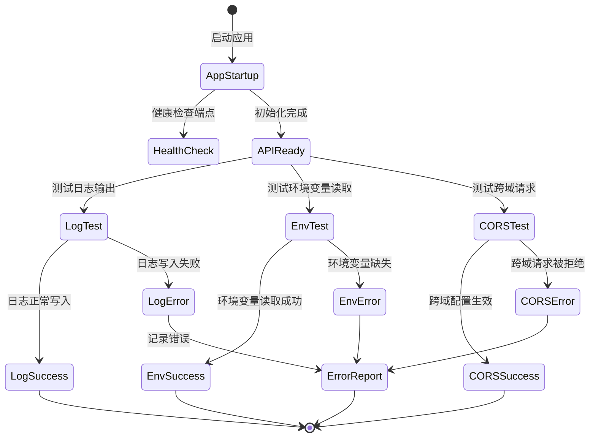

# UX 设计 — Initialize FastAPI project structure and core configuration

> 所属需求：后端 API 服务搭建

## 交互流程图



**说明**：
- 应用启动后自动初始化所有核心配置
- 提供健康检查端点供外部监控
- 各配置项可独立测试验证
- 错误统一汇总到错误报告机制
```

## 组件线框说明

## 项目目录结构

```
project_root/
├── app/
│   ├── __init__.py          # 应用初始化入口
│   ├── main.py              # FastAPI 应用实例
│   ├── api/                 # API 路由层
│   │   ├── __init__.py
│   │   ├── v1/              # API 版本管理
│   │   │   ├── __init__.py
│   │   │   └── endpoints/   # 具体端点
│   │   │       ├── __init__.py
│   │   │       └── health.py  # 健康检查端点
│   ├── core/                # 核心配置
│   │   ├── __init__.py
│   │   ├── config.py        # 环境变量配置类
│   │   ├── logging.py       # 日志配置
│   │   └── security.py      # CORS 等安全配置
│   ├── models/              # 数据库模型（预留）
│   │   └── __init__.py
│   ├── schemas/             # Pydantic 数据模型
│   │   ├── __init__.py
│   │   └── health.py        # 健康检查响应模型
│   ├── services/            # 业务逻辑层（预留）
│   │   └── __init__.py
│   └── utils/               # 工具函数
│       ├── __init__.py
│       └── helpers.py       # 通用辅助函数
├── logs/                    # 日志输出目录
│   └── .gitkeep
├── tests/                   # 测试目录
│   ├── __init__.py
│   ├── test_config.py       # 配置测试
│   ├── test_logging.py      # 日志测试
│   └── test_health.py       # 健康检查测试
├── .env.example             # 环境变量模板
├── .gitignore               # Git 忽略配置
├── requirements.txt         # 依赖清单
└── README.md                # 项目说明
```

## 核心组件说明

### 1. FastAPI 应用实例 (main.py)
- 创建 FastAPI() 实例
- 注册路由（health check）
- 挂载 CORS 中间件
- 配置启动/关闭事件钩子

### 2. 配置管理 (core/config.py)
- 使用 Pydantic BaseSettings
- 从 .env 文件读取配置
- 提供配置验证和类型转换
- 支持多环境配置（dev/staging/prod）

### 3. 日志系统 (core/logging.py)
- 配置 Python logging 模块
- 根据环境输出到文件/控制台
- 日志格式：时间戳 + 级别 + 模块 + 消息
- 日志轮转策略（按大小/时间）

### 4. CORS 配置 (core/security.py)
- 配置允许的源（origins）
- 配置允许的方法（GET/POST/PUT/DELETE）
- 配置允许的请求头
- 配置是否允许凭证

### 5. 健康检查端点 (api/v1/endpoints/health.py)
- GET /health：返回服务状态
- 响应包含：状态码、环境信息、时间戳

## 交互状态定义

## API 端点状态

### 健康检查端点 (/health)
- **正常（200 OK）**：服务运行正常，返回 JSON 响应
  ```json
  {
    "status": "healthy",
    "environment": "development",
    "timestamp": "2024-01-01T12:00:00Z"
  }
  ```
- **服务不可用（503 Service Unavailable）**：依赖服务异常（数据库连接失败等）
- **超时（504 Gateway Timeout）**：响应时间超过阈值

### 应用启动状态
- **启动中（Starting）**：读取配置、初始化日志、注册路由
- **就绪（Ready）**：所有组件初始化完成，可接受请求
- **关闭中（Shutting Down）**：清理资源、关闭连接
- **异常（Error）**：启动失败，输出错误日志并退出

## 配置加载状态

### 环境变量读取
- **成功（Loaded）**：所有必需变量存在且格式正确
- **部分缺失（Partial）**：使用默认值补全，记录 warning 日志
- **验证失败（Invalid）**：类型错误或值不合法，抛出 ValidationError
- **文件不存在（Missing）**：.env 文件缺失，使用系统环境变量

### 日志系统状态
- **正常输出（Active）**：日志正常写入目标（文件/控制台）
- **写入失败（Write Error）**：磁盘满、权限不足等，降级到 stderr
- **轮转中（Rotating）**：日志文件达到大小限制，创建新文件

## CORS 请求状态

### 预检请求（OPTIONS）
- **允许（200 OK）**：返回 CORS 响应头，允许后续请求
- **拒绝（403 Forbidden）**：源不在白名单，拒绝跨域

### 实际请求（GET/POST/etc.）
- **正常响应**：附带 Access-Control-Allow-Origin 等响应头
- **跨域拒绝**：不返回 CORS 响应头，浏览器拦截响应

## 错误处理状态

### 全局异常捕获
- **已知异常（Handled）**：返回标准错误响应（4xx/5xx + JSON）
- **未知异常（Unhandled）**：记录完整堆栈，返回 500 Internal Server Error
- **验证错误（422 Unprocessable Entity）**：请求参数不符合 schema 定义

## 响应式/适配规则

## 适用场景说明

本项目为**纯后端 API 服务**，无前端 UI 界面，因此传统的响应式设计规则（断点、布局适配）不适用。

## API 响应式设计原则

### 1. 接口版本管理
- **路径版本化**：`/api/v1/`, `/api/v2/`
- **向后兼容**：旧版本至少保留一个大版本周期
- **废弃通知**：响应头添加 `X-API-Deprecated: true`

### 2. 响应格式适配
- **内容协商**：根据 `Accept` 请求头返回 JSON/XML/MessagePack
- **字段过滤**：支持 `?fields=id,name` 查询参数减少响应体积
- **分页策略**：
  - 移动端默认 `page_size=20`
  - Web 端默认 `page_size=50`
  - 最大限制 `page_size=100`

### 3. 性能适配
- **压缩**：启用 gzip/brotli 压缩（响应体 > 1KB）
- **缓存策略**：
  - 静态数据：`Cache-Control: public, max-age=3600`
  - 动态数据：`Cache-Control: private, no-cache`
- **超时配置**：
  - 移动网络：`timeout=30s`
  - 稳定网络：`timeout=10s`

### 4. 错误响应适配
- **详细程度**：
  - 开发环境：返回完整堆栈信息
  - 生产环境：仅返回错误码和用户友好消息
- **国际化**：根据 `Accept-Language` 返回对应语言错误消息

### 5. 日志输出适配
- **开发环境**：
  - 输出到控制台
  - 日志级别：DEBUG
  - 格式：彩色 + 详细堆栈
- **生产环境**：
  - 输出到文件（按日期轮转）
  - 日志级别：INFO
  - 格式：JSON 结构化日志

### 6. 环境配置适配
```
Development:
  - DEBUG=true
  - CORS_ORIGINS=*
  - LOG_LEVEL=DEBUG

Staging:
  - DEBUG=false
  - CORS_ORIGINS=https://staging.example.com
  - LOG_LEVEL=INFO

Production:
  - DEBUG=false
  - CORS_ORIGINS=https://example.com
  - LOG_LEVEL=WARNING
```

## UI 资产清单（初稿）

## 说明

本项目为**纯后端 API 服务**，无前端界面，因此不需要传统 UI 资产（图标、插画、图片等）。

## 文档资产需求

### 1. API 文档图标
- **用途**：Swagger UI / ReDoc 自动生成文档的 favicon
- **格式**：favicon.ico (16x16, 32x32)
- **风格**：简洁的 API 符号（如 `{...}` 或 `</>` ）
- **来源**：使用 FastAPI 默认图标或自定义

### 2. 日志查看器图标（可选）
- **用途**：如果部署日志管理界面（如 Grafana/Kibana）
- **格式**：SVG 或 PNG (24x24)
- **风格**：文件/列表图标
- **来源**：开源图标库（Feather Icons / Heroicons）

### 3. 状态指示图标（监控面板用）
- icon: check-circle（健康状态，24px，filled 风格，绿色）
- icon: alert-triangle（警告状态，24px，filled 风格，黄色）
- icon: x-circle（错误状态，24px，filled 风格，红色）
- icon: activity（性能监控，24px，outline 风格）

## 代码资产需求

### 1. 配置文件模板
- **文件**：.env.example
- **内容**：所有环境变量的示例值和注释
- **用途**：开发者快速配置本地环境

### 2. Docker 相关（如需容器化）
- **文件**：Dockerfile, docker-compose.yml
- **用途**：标准化部署环境

### 3. CI/CD 配置（如需自动化）
- **文件**：.github/workflows/ci.yml 或 .gitlab-ci.yml
- **用途**：自动化测试和部署

## 文档资产

### 1. README.md
- 项目简介
- 快速开始指南
- 环境变量说明
- API 端点列表
- 开发规范链接

### 2. API 文档
- **自动生成**：FastAPI 自带 Swagger UI (`/docs`) 和 ReDoc (`/redoc`)
- **手动补充**：复杂业务逻辑的流程图（Mermaid）

### 3. 架构图
- **格式**：Mermaid diagram 或 draw.io
- **内容**：目录结构、请求流程、依赖关系

## 无需资产项

❌ 不需要：
- 前端 UI 组件库
- 品牌 Logo / 插画
- 用户头像占位图
- 空状态插画
- 加载动画
- 响应式布局图
