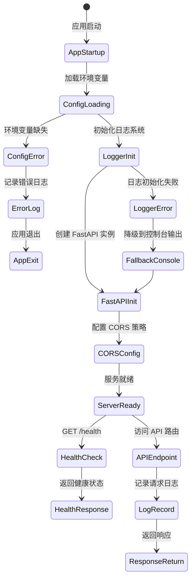

# UX 设计 — Initialize FastAPI project structure and core configuration

> 所属需求：后端 API 服务搭建

## 交互流程图


```

## 组件线框说明

## 项目目录结构

```
project_root/
├── app/
│   ├── __init__.py
│   ├── main.py                 # FastAPI 应用入口
│   ├── api/                    # API 路由层
│   │   ├── __init__.py
│   │   ├── v1/                 # API 版本目录
│   │   │   ├── __init__.py
│   │   │   └── endpoints/      # 具体端点
│   │   │       └── __init__.py
│   ├── core/                   # 核心配置
│   │   ├── __init__.py
│   │   ├── config.py           # 环境变量配置类
│   │   ├── logging.py          # 日志配置
│   │   └── security.py         # 安全相关（预留）
│   ├── models/                 # 数据模型（ORM）
│   │   └── __init__.py
│   ├── schemas/                # Pydantic 数据模式
│   │   ├── __init__.py
│   │   └── health.py           # 健康检查响应模式
│   ├── services/               # 业务逻辑层
│   │   └── __init__.py
│   └── utils/                  # 工具函数
│       └── __init__.py
├── logs/                       # 日志文件目录（运行时生成）
├── tests/                      # 测试目录
│   └── __init__.py
├── .env.example                # 环境变量示例文件
├── .gitignore
├── requirements.txt            # 依赖清单
└── README.md
```

## 核心组件说明

### 1. main.py（应用入口）
- FastAPI 应用实例创建
- 中间件注册（CORS）
- 路由注册
- 启动/关闭事件处理
- 健康检查端点：GET /health

### 2. core/config.py（配置管理）
- 环境变量加载（使用 pydantic-settings）
- 配置项：
  - APP_NAME: 应用名称
  - APP_VERSION: 版本号
  - DEBUG: 调试模式
  - LOG_LEVEL: 日志级别
  - CORS_ORIGINS: 允许的跨域来源
  - API_PREFIX: API 路由前缀

### 3. core/logging.py（日志系统）
- 日志格式配置（JSON 格式用于生产环境）
- 日志输出目标：
  - 开发环境：控制台（彩色输出）
  - 生产环境：文件（按日期轮转）+ 控制台
- 日志级别：DEBUG / INFO / WARNING / ERROR
- 请求日志中间件（记录请求路径、方法、耗时、状态码）

### 4. schemas/health.py（健康检查模式）
- HealthResponse 模式：
  - status: 服务状态（healthy/unhealthy）
  - version: 应用版本
  - timestamp: 检查时间戳

## 交互状态定义

## 应用启动状态

### 配置加载
- **正常（normal）**：成功从 .env 加载所有必需配置，日志输出「Configuration loaded successfully」
- **部分缺失（warning）**：使用默认值，日志输出「Using default value for {key}」
- **严重错误（error）**：必需配置缺失，日志输出「Missing required config: {key}」，应用退出（exit code 1）

### 日志系统初始化
- **正常（normal）**：日志目录创建成功，文件可写，输出「Logger initialized: {log_file_path}」
- **降级（fallback）**：日志目录创建失败，降级到仅控制台输出，警告「Failed to create log directory, falling back to console only」
- **禁用（disabled）**：DEBUG=False 时，日志级别自动提升到 INFO

### CORS 配置
- **开发模式（dev）**：允许所有来源（*），日志输出「CORS: Allow all origins (dev mode)」
- **生产模式（prod）**：仅允许配置的白名单来源，日志输出「CORS: Allowed origins - {origins}」
- **未配置（default）**：使用空白名单（拒绝所有跨域），警告「CORS origins not configured」

## API 端点状态

### 健康检查端点（GET /health）
- **正常（200）**：返回 {"status": "healthy", "version": "x.x.x", "timestamp": "ISO8601"}
- **服务异常（503）**：依赖服务不可用时返回 {"status": "unhealthy", "reason": "database unreachable"}（预留）

### 通用 API 响应状态
- **成功（2xx）**：正常返回数据 + 请求日志（INFO 级别）
- **客户端错误（4xx）**：返回错误详情 + 请求日志（WARNING 级别）
- **服务器错误（5xx）**：返回通用错误消息 + 完整堆栈日志（ERROR 级别）
- **请求超时（timeout）**：30s 超时，返回 504 Gateway Timeout

## 日志输出状态

### 控制台输出（开发环境）
- **DEBUG**：灰色文本，显示详细调试信息
- **INFO**：白色文本，显示正常操作日志
- **WARNING**：黄色文本，显示警告信息
- **ERROR**：红色文本，显示错误 + 堆栈跟踪

### 文件输出（生产环境）
- **正常写入**：JSON 格式，每行一条日志记录
- **文件轮转**：每日生成新文件（app_YYYY-MM-DD.log），保留 30 天
- **磁盘满（error）**：捕获写入异常，降级到控制台输出，发送告警（预留）

## 响应式/适配规则

## 服务端应用响应式规则

### 环境适配
- **开发环境（DEBUG=True）**：
  - 启用详细日志（DEBUG 级别）
  - 允许所有 CORS 来源
  - 启用 FastAPI 自动文档（/docs、/redoc）
  - 热重载启用（uvicorn --reload）

- **生产环境（DEBUG=False）**：
  - 日志级别 INFO 及以上
  - 严格 CORS 白名单
  - 禁用自动文档（或需要认证）
  - 多进程部署（uvicorn workers > 1）

### 日志输出适配
- **本地开发**：控制台彩色输出 + 人类可读格式
- **容器部署**：stdout 输出 JSON 格式（便于日志收集系统解析）
- **传统服务器**：文件输出 + logrotate 配置

### 配置加载优先级
1. 环境变量（最高优先级）
2. .env 文件
3. 代码中的默认值（最低优先级）

### 性能适配
- **并发连接数**：根据 CPU 核心数自动调整 worker 数量（推荐 2 * CPU_CORES + 1）
- **日志缓冲**：生产环境启用日志缓冲（减少 I/O 开销）
- **CORS 预检缓存**：设置 max_age=3600（1小时）

### 错误处理适配
- **开发环境**：返回完整错误堆栈
- **生产环境**：返回通用错误消息，堆栈仅记录到日志文件

## UI 资产清单（初稿）

## 日志相关资产

### 日志格式模板
- **开发环境日志格式**：
  ```
  [%(asctime)s] %(levelname)-8s | %(name)s:%(lineno)d | %(message)s
  ```
  用途：控制台输出，便于开发调试

- **生产环境日志格式（JSON）**：
  ```json
  {
    "timestamp": "ISO8601",
    "level": "INFO",
    "logger": "app.api.v1",
    "message": "Request processed",
    "request_id": "uuid",
    "duration_ms": 123
  }
  ```
  用途：结构化日志，便于日志分析系统解析

## 配置文件资产

### .env.example（环境变量模板）
```env
# Application
APP_NAME=FastAPI Service
APP_VERSION=0.1.0
DEBUG=True

# Logging
LOG_LEVEL=DEBUG
LOG_FILE_PATH=logs/app.log

# CORS
CORS_ORIGINS=http://localhost:3000,http://localhost:8080

# API
API_PREFIX=/api/v1
```
用途：提供给开发者的配置示例，不包含敏感信息

### .gitignore 条目
```
.env
.env.*
!.env.example
logs/
__pycache__/
*.pyc
.pytest_cache/
```
用途：防止敏感文件和临时文件提交到版本控制

## 文档资产

### README.md 必需章节
- **Quick Start**：如何启动项目（安装依赖 → 配置 .env → 运行命令）
- **Project Structure**：目录结构说明
- **Environment Variables**：所有环境变量说明（名称、类型、默认值、用途）
- **API Documentation**：如何访问 Swagger UI（/docs）
- **Logging**：日志文件位置、日志级别配置说明

## 无需 UI 资产
本工单为后端基础设施搭建，不涉及前端界面，因此无需图标、插画、图片等视觉资产。所有输出为代码、配置文件和文档。
