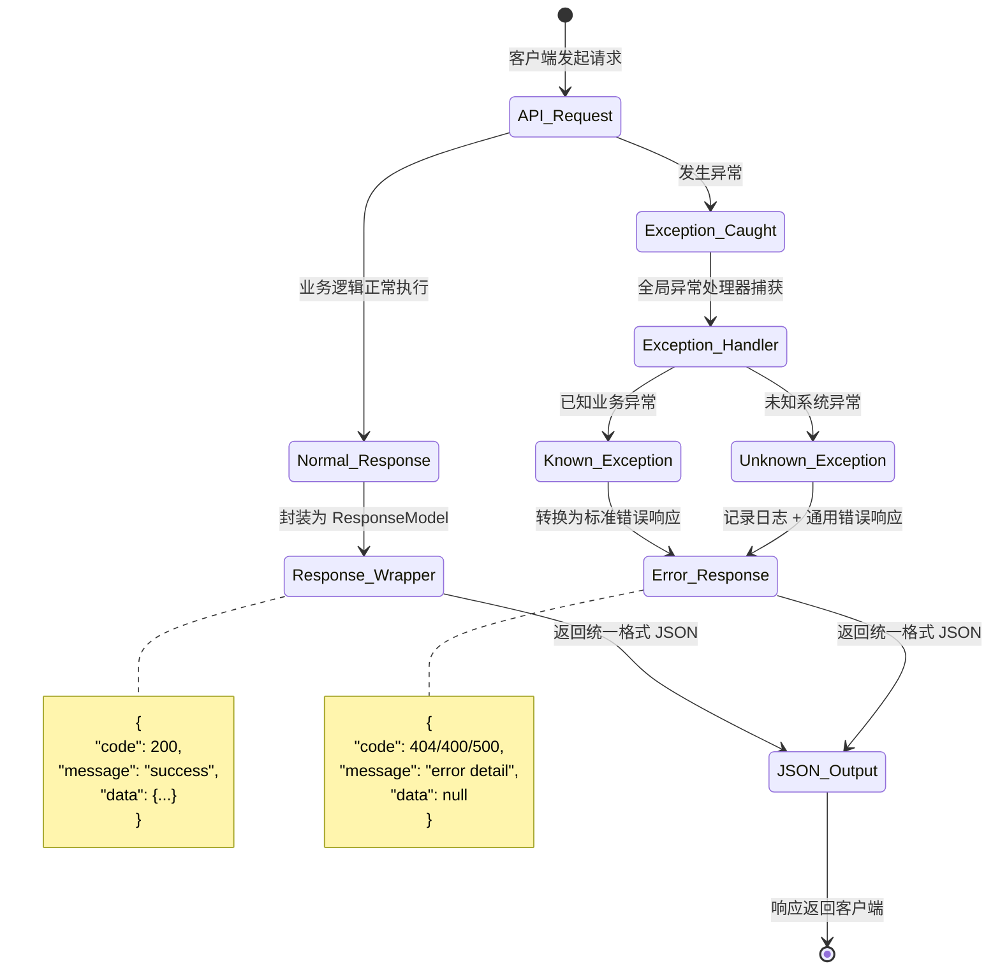

# UX 设计 — Create unified response format and exception handler middleware

> 所属需求：后端 API 服务搭建

## 交互流程图


```

## 组件线框说明

## 核心组件结构

### 1. ResponseModel (app/schemas/response.py)
```
[ResponseModel 数据结构]
├─ code: int (HTTP 状态码或业务码)
├─ message: str (响应消息)
├─ data: Optional[Any] (业务数据)
└─ timestamp: Optional[datetime] (响应时间戳)
```

### 2. 异常类层级 (app/core/exceptions.py)
```
[BaseAPIException] (基类)
├─ status_code: int
├─ message: str
└─ code: Optional[str]

[业务异常子类]
├─ NotFoundError (404)
├─ ValidationError (400)
├─ UnauthorizedError (401)
├─ ForbiddenError (403)
├─ ConflictError (409)
└─ InternalServerError (500)
```

### 3. 异常处理中间件 (app/middleware/exception_handler.py)
```
[ExceptionHandlerMiddleware]
├─ __call__(request, call_next)
│   ├─ try: 执行请求处理
│   └─ except:
│       ├─ BaseAPIException → 转换为标准响应
│       ├─ RequestValidationError → 422 响应
│       ├─ HTTPException → 保留 FastAPI 原生处理
│       └─ Exception → 500 通用错误 + 日志记录
└─ _format_error_response(exc) → ResponseModel
```

### 4. FastAPI 异常处理器注册 (app/main.py)
```
[FastAPI App]
├─ add_middleware(ExceptionHandlerMiddleware)
├─ add_exception_handler(BaseAPIException, handler)
├─ add_exception_handler(RequestValidationError, handler)
└─ add_exception_handler(Exception, handler)
```

### 5. 响应工具函数 (app/schemas/response.py)
```
[Helper Functions]
├─ success_response(data, message) → ResponseModel
├─ error_response(code, message) → ResponseModel
└─ paginated_response(items, total, page, size) → ResponseModel
```

## 交互状态定义

## 组件交互状态定义

### ResponseModel（数据模型）
- **正常返回**：code=200, message="success", data 包含业务数据
- **业务错误**：code=400-499, message 描述错误原因, data=null
- **系统错误**：code=500-599, message="Internal server error", data=null
- **空数据**：code=200, message="success", data=[] 或 data=null（明确区分）

### 异常处理器（中间件）
- **捕获前**：请求正常流转到业务逻辑
- **捕获中**：检测异常类型 → 匹配对应处理器
- **已知异常**：提取 status_code 和 message → 构造 ResponseModel
- **未知异常**：记录完整堆栈到日志 → 返回通用 500 响应（不暴露内部细节）
- **验证错误**：解析 Pydantic ValidationError → 格式化字段错误列表 → 422 响应

### 业务异常类
- **抛出时**：携带 status_code、message、可选 code（业务错误码）
- **被捕获**：自动转换为对应 HTTP 状态码的 ResponseModel
- **日志记录**：
  - 4xx 错误：info 级别（客户端问题）
  - 5xx 错误：error 级别 + 完整堆栈（服务端问题）

### API 端点响应
- **成功场景**：
  - 单条数据：`{"code": 200, "message": "success", "data": {...}}`
  - 列表数据：`{"code": 200, "message": "success", "data": [{...}, {...}]}`
  - 分页数据：`{"code": 200, "message": "success", "data": {"items": [...], "total": 100, "page": 1, "size": 20}}`
  - 无返回值操作（如删除）：`{"code": 200, "message": "deleted successfully", "data": null}`

- **错误场景**：
  - 资源不存在：`{"code": 404, "message": "User not found", "data": null}`
  - 参数校验失败：`{"code": 400, "message": "Validation error", "data": {"errors": [{"field": "email", "message": "invalid format"}]}}`
  - 未授权：`{"code": 401, "message": "Authentication required", "data": null}`
  - 服务器错误：`{"code": 500, "message": "Internal server error", "data": null}`

### 日志输出状态
- **请求开始**：记录 method、path、client_ip
- **异常捕获**：记录异常类型、消息、堆栈（5xx）
- **响应返回**：记录 status_code、响应时间

## 响应式/适配规则

## 响应式规则（后端 API 场景）

### 数据格式适配
- **所有端点**：统一返回 JSON 格式，Content-Type: application/json
- **字段命名**：snake_case（Python 风格），前端可通过拦截器转换为 camelCase
- **时间格式**：ISO 8601 字符串（`2024-01-15T10:30:00Z`），或 Unix 时间戳（毫秒）

### 错误信息详细度
- **开发环境**：返回完整错误堆栈和调试信息
- **生产环境**：隐藏内部实现细节，仅返回用户友好的错误消息
- **验证错误**：返回字段级错误列表（field + message）

### HTTP 状态码映射
- **2xx**：成功响应，ResponseModel.code = HTTP 状态码
- **4xx**：客户端错误，ResponseModel.code = 具体错误码（400/401/403/404/422）
- **5xx**：服务端错误，ResponseModel.code = 500（不细分具体类型）

### 跨域和请求头
- **CORS**：允许的 origins 通过环境变量配置
- **Rate Limiting**：超限时返回 429 + Retry-After 头
- **API 版本**：通过 URL 路径（/api/v1/）或 Accept 头指定

### 日志级别
- **开发环境**：DEBUG 级别，输出详细请求/响应
- **生产环境**：INFO 级别，仅记录关键操作和错误
- **敏感信息**：密码、token 等在日志中脱敏（***）

### 性能考虑
- **异常处理开销**：中间件捕获异常不应显著增加响应时间（< 5ms）
- **日志写入**：异步写入，不阻塞请求处理
- **错误响应缓存**：对于静态错误页面（如 404），可设置短期缓存

## UI 资产清单（初稿）

## UI 资产清单（后端 API 无 UI 资产需求）

### 文档资产
- **API 文档**：Swagger UI / ReDoc 自动生成（FastAPI 内置）
- **错误码表**：Markdown 文档，列出所有业务错误码及说明
  - 格式：`| 错误码 | HTTP 状态 | 说明 | 示例场景 |`
  - 示例：`| 40001 | 400 | 参数缺失 | 必填字段未提供 |`

### 日志格式模板
- **请求日志**：`[{timestamp}] {method} {path} - Client: {ip} - User: {user_id}`
- **异常日志**：`[{timestamp}] ERROR {exception_type}: {message}\n{traceback}`
- **响应日志**：`[{timestamp}] Response {status_code} - Duration: {ms}ms`

### 配置文件示例
- **异常映射配置**（JSON/YAML）：
  ```json
  {
    "NotFoundError": {"status_code": 404, "default_message": "Resource not found"},
    "ValidationError": {"status_code": 400, "default_message": "Invalid input"}
  }
  ```

### 测试数据集
- **正常响应示例**：各类成功场景的 JSON 样本
- **错误响应示例**：各类异常场景的 JSON 样本
- **边界用例**：空数据、超大数据、特殊字符等测试数据

### 监控指标
- **异常统计图表**：按异常类型统计发生频率（需对接监控系统）
- **响应时间分布**：P50/P95/P99 延迟（需对接 APM 工具）

---

**说明**：本工单为纯后端基础设施建设，无传统 UI 资产（图标/插画/图片）需求。主要产出为代码模块、文档和配置文件。
