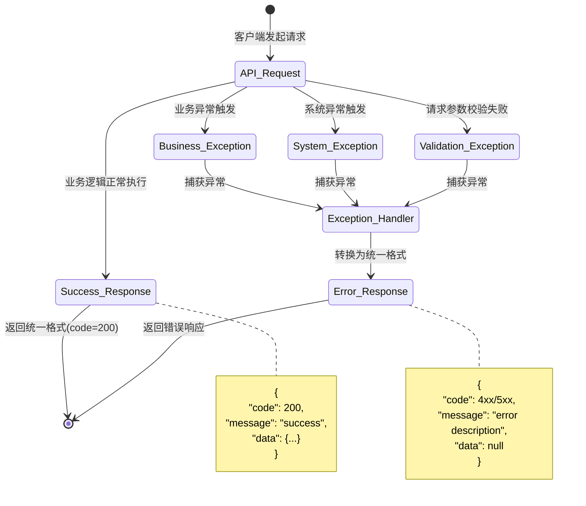

# UX 设计 — Create unified response format and exception handler middleware

> 所属需求：后端 API 服务搭建

## 交互流程图


```

## 组件线框说明

## 核心组件结构

### 1. ResponseModel (app/schemas/response.py)
```
[ResponseModel 数据结构]
├── code: int (HTTP 状态码或业务状态码)
├── message: str (响应消息描述)
└── data: Optional[Any] (实际业务数据)
```

### 2. Exception Handler Middleware (app/middleware/exception_handler.py)
```
[全局异常处理中间件]
├── 捕获所有未处理异常
├── 识别异常类型
│   ├── 业务异常 (自定义异常类)
│   ├── 验证异常 (Pydantic ValidationError)
│   ├── HTTP 异常 (FastAPI HTTPException)
│   └── 系统异常 (Exception)
├── 转换为 ResponseModel 格式
└── 记录日志 (error/warning 级别)
```

### 3. Custom Exception Classes (app/exceptions/business.py)
```
[业务异常类层次]
├── BaseBusinessException (基类)
│   ├── code: int
│   ├── message: str
│   └── detail: Optional[dict]
├── NotFoundError (404 资源不存在)
├── ValidationError (400 业务验证失败)
├── UnauthorizedError (401 未授权)
├── ForbiddenError (403 无权限)
└── ConflictError (409 资源冲突)
```

### 4. FastAPI Exception Handlers (app/main.py)
```
[异常处理器注册]
├── @app.exception_handler(BaseBusinessException)
├── @app.exception_handler(RequestValidationError)
├── @app.exception_handler(HTTPException)
└── @app.exception_handler(Exception) [兜底处理器]
```

### 5. Response Helper Functions (app/schemas/response.py)
```
[响应构造辅助函数]
├── success_response(data, message) -> ResponseModel
├── error_response(code, message, data) -> ResponseModel
└── paginated_response(items, total, page, size) -> ResponseModel
```

## 交互状态定义

## 异常处理中间件状态

### 正常执行流程
- **default**: 请求进入 → 业务逻辑执行 → 返回 ResponseModel(code=200)
- **logging**: 记录 info 级别日志（请求路径、耗时、状态码）

### 业务异常捕获
- **caught**: 捕获 BaseBusinessException 及其子类
- **transforming**: 提取 exception.code 和 exception.message
- **logging**: 记录 warning 级别日志（异常类型、业务错误码、请求上下文）
- **responding**: 返回 ResponseModel(code=exception.code, message=exception.message, data=None)

### 验证异常捕获
- **caught**: 捕获 Pydantic RequestValidationError
- **parsing**: 解析验证错误详情（字段名、错误类型、错误值）
- **logging**: 记录 warning 级别日志（验证失败字段列表）
- **responding**: 返回 ResponseModel(code=400, message="Validation failed", data={"errors": [...]})

### HTTP 异常捕获
- **caught**: 捕获 FastAPI HTTPException
- **logging**: 记录 warning 级别日志（HTTP 状态码、detail）
- **responding**: 返回 ResponseModel(code=exception.status_code, message=exception.detail, data=None)

### 系统异常捕获（兜底）
- **caught**: 捕获所有未处理的 Exception
- **logging**: 记录 error 级别日志（完整堆栈信息、请求 ID、用户信息）
- **masking**: 生产环境隐藏敏感错误信息
- **responding**: 返回 ResponseModel(code=500, message="Internal server error", data=None)
- **alerting**: 触发告警（可选，严重错误时）

## 自定义异常类状态

### NotFoundError
- **instantiated**: 创建时指定资源类型和 ID
- **raised**: 抛出异常（code=404, message="{resource} not found"）

### ValidationError
- **instantiated**: 创建时指定验证失败字段和原因
- **raised**: 抛出异常（code=400, message="Validation error", detail={field: reason}）

### UnauthorizedError
- **instantiated**: 创建时可指定认证失败原因
- **raised**: 抛出异常（code=401, message="Unauthorized"）

### ForbiddenError
- **instantiated**: 创建时可指定权限不足的资源
- **raised**: 抛出异常（code=403, message="Forbidden"）

### ConflictError
- **instantiated**: 创建时指定冲突的资源
- **raised**: 抛出异常（code=409, message="Resource conflict"）

## ResponseModel 构造状态

### success_response
- **default**: 接收业务数据和可选消息
- **constructing**: 构造 ResponseModel(code=200, message=message or "success", data=data)
- **serializing**: 自动序列化为 JSON（FastAPI 自动处理）

### error_response
- **default**: 接收错误码、错误消息、可选详情
- **constructing**: 构造 ResponseModel(code=code, message=message, data=data)
- **serializing**: 返回 JSON 格式错误响应

### paginated_response
- **default**: 接收列表数据、总数、页码、页大小
- **constructing**: 构造 ResponseModel(code=200, data={"items": [...], "total": n, "page": p, "size": s})
- **serializing**: 返回分页格式响应

## 响应式/适配规则

## 响应式规则说明

**本工单为后端 API 服务，无前端 UI 界面，不涉及响应式布局。**

### API 响应格式统一规则

#### 所有端点返回格式
- **统一结构**: 所有 API 端点必须返回 ResponseModel 格式
- **Content-Type**: application/json
- **字符编码**: UTF-8

#### 成功响应格式
```json
{
  "code": 200,
  "message": "success",
  "data": {
    // 实际业务数据
  }
}
```

#### 错误响应格式
```json
{
  "code": 400/401/403/404/409/500,
  "message": "错误描述信息",
  "data": null  // 或包含错误详情的对象
}
```

#### 分页响应格式
```json
{
  "code": 200,
  "message": "success",
  "data": {
    "items": [...],
    "total": 100,
    "page": 1,
    "size": 20
  }
}
```

### HTTP 状态码映射规则

- **200**: 成功响应（GET/PUT/PATCH 成功）
- **201**: 资源创建成功（POST 成功）
- **204**: 无内容（DELETE 成功）
- **400**: 请求参数验证失败
- **401**: 未认证/认证失败
- **403**: 无权限访问
- **404**: 资源不存在
- **409**: 资源冲突（如重复创建）
- **500**: 服务器内部错误

### 跨域和客户端兼容

- **CORS 头**: 中间件自动添加 CORS 响应头（如已配置）
- **JSON 序列化**: 使用 FastAPI 默认 JSON 编码器（支持 datetime/Decimal 等类型）
- **字段命名**: 统一使用 snake_case（Python 风格）
- **空值处理**: null 字段保留（不省略），前端可明确判断

### 性能和缓存规则

- **响应压缩**: 启用 gzip 压缩（响应体 > 1KB 时）
- **缓存控制**: 错误响应设置 Cache-Control: no-cache
- **请求 ID**: 响应头添加 X-Request-ID（用于日志追踪）

## UI 资产清单（初稿）

## UI 资产清单

**本工单为后端 API 服务，无前端 UI 界面，不需要图标、插画、图片等视觉资产。**

### 日志和监控相关（非 UI 资产）

#### 日志格式模板
- **用途**: 异常处理中间件日志输出
- **格式**: JSON 结构化日志
- **字段**:
  - timestamp: ISO 8601 格式时间戳
  - level: info/warning/error
  - request_id: UUID 格式请求 ID
  - path: 请求路径
  - method: HTTP 方法
  - status_code: 响应状态码
  - exception_type: 异常类名（如有）
  - exception_message: 异常消息（如有）
  - stack_trace: 堆栈信息（仅 error 级别）

#### 错误消息文案库
- **用途**: 标准化错误提示信息
- **语言**: 英文（代码中）+ 中文（可选，通过 i18n）
- **示例**:
  - NOT_FOUND: "The requested resource was not found"
  - VALIDATION_FAILED: "Request validation failed"
  - UNAUTHORIZED: "Authentication required"
  - FORBIDDEN: "You don't have permission to access this resource"
  - INTERNAL_ERROR: "An internal server error occurred"

### 文档资产（开发者文档）

#### API 文档示例
- **用途**: OpenAPI/Swagger 文档中的响应示例
- **格式**: JSON Schema + 示例数据
- **内容**: 每个端点的成功/失败响应示例

#### 异常处理流程图
- **用途**: 开发者文档说明异常处理机制
- **格式**: Mermaid 流程图（已在 interaction_flow 中提供）

### 测试资产

#### 单元测试 Mock 数据
- **用途**: 测试异常处理器的各种场景
- **内容**:
  - 正常响应 mock 数据
  - 各类异常实例
  - 边界情况测试数据

#### 集成测试用例
- **用途**: 验证端到端异常处理流程
- **内容**:
  - 触发各类异常的请求样本
  - 预期响应格式验证数据

---

**总结**: 本工单无传统 UI 资产需求，主要资产为日志模板、错误文案库和测试数据。
