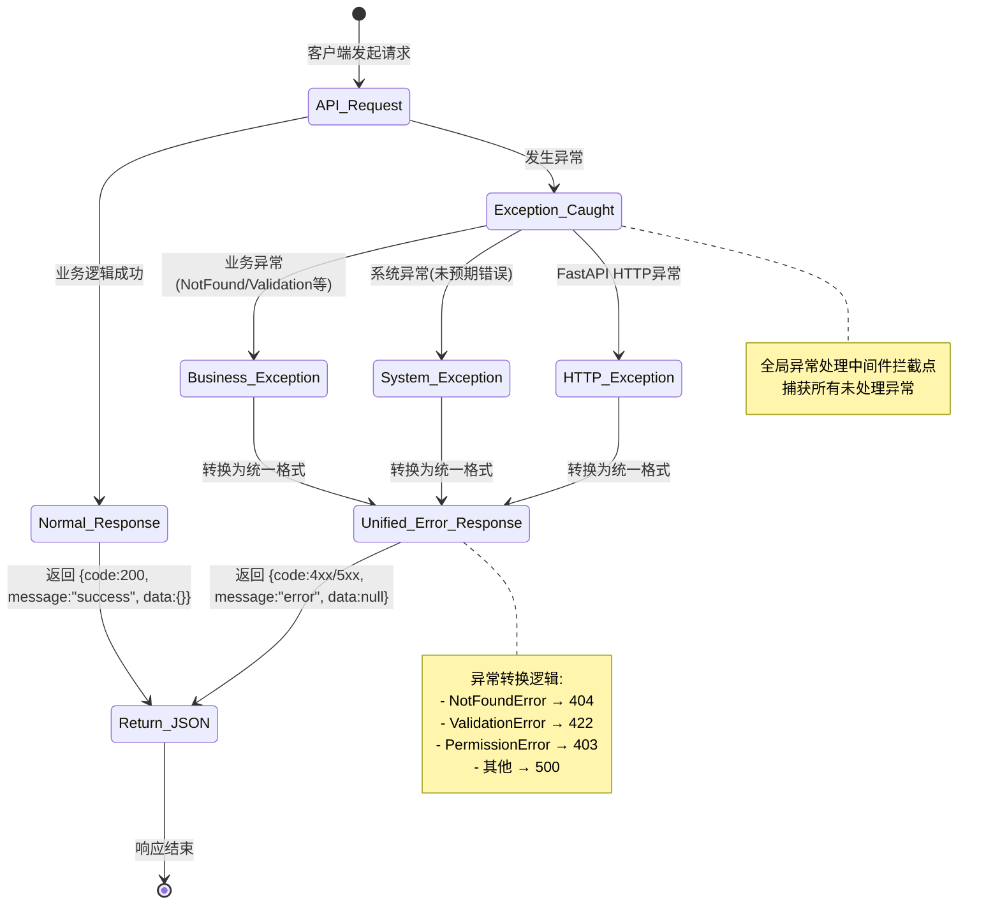

# UX 设计 — Create unified response format and exception handler middleware

> 所属需求：后端 API 服务搭建

## 交互流程图


```

## 组件线框说明

## 核心组件结构

### 1. ResponseModel (app/schemas/response.py)
```
[ResponseModel 数据结构]
├── code: int (HTTP 状态码)
├── message: str (响应消息)
├── data: Optional[Any] (业务数据)
└── timestamp: Optional[str] (响应时间戳)
```

### 2. 异常类层级 (app/core/exceptions.py)
```
[BaseAPIException] (基类)
├── status_code: int
├── message: str
└── detail: Optional[dict]

[业务异常子类]
├── NotFoundError (404)
├── ValidationError (422)
├── PermissionDeniedError (403)
├── UnauthorizedError (401)
├── ConflictError (409)
└── BusinessLogicError (400)
```

### 3. 异常处理中间件 (app/middleware/exception_handler.py)
```
[ExceptionHandlerMiddleware]
├── __call__(request, call_next)
│   ├── try: 执行请求
│   └── except: 捕获异常
│       ├── 判断异常类型
│       ├── 记录日志
│       └── 返回统一格式
└── _format_exception_response()
    └── 转换为 ResponseModel
```

### 4. FastAPI 异常处理器注册 (app/main.py)
```
[FastAPI App]
├── add_exception_handler(BaseAPIException)
├── add_exception_handler(RequestValidationError)
├── add_exception_handler(HTTPException)
└── add_middleware(ExceptionHandlerMiddleware)
```

### 5. 响应工具函数 (app/schemas/response.py)
```
[辅助函数]
├── success_response(data, message) → ResponseModel
├── error_response(code, message, detail) → ResponseModel
└── paginated_response(items, total, page, size) → ResponseModel
```

## 交互状态定义

## 组件交互状态定义

### ResponseModel (数据模型)
- **正常返回 (Normal)**
  - code: 200-299
  - message: "success" / "操作成功"
  - data: 包含业务数据
  - 示例: `{"code": 200, "message": "success", "data": {"id": 1}}`

- **客户端错误 (Client Error)**
  - code: 400-499
  - message: 具体错误描述
  - data: null 或错误详情
  - 示例: `{"code": 404, "message": "Resource not found", "data": null}`

- **服务端错误 (Server Error)**
  - code: 500-599
  - message: "Internal server error" / "服务异常"
  - data: null (生产环境不暴露堆栈)
  - 示例: `{"code": 500, "message": "Internal server error", "data": null}`

### 异常处理中间件 (Middleware)
- **捕获前 (Before Catch)**
  - 状态: 请求正常流转
  - 行为: 透明传递请求

- **捕获中 (Catching)**
  - 状态: 检测到异常
  - 行为: 记录日志(logger.error)、提取异常信息

- **转换后 (After Transform)**
  - 状态: 异常已转换为统一格式
  - 行为: 返回 ResponseModel JSON

### 业务异常类 (Exception Classes)
- **未触发 (Not Raised)**
  - 状态: 业务逻辑正常
  - 行为: 不实例化异常

- **触发 (Raised)**
  - 状态: 业务条件不满足
  - 行为: `raise NotFoundError("User not found")`
  - 传播: 向上抛出至中间件

- **已处理 (Handled)**
  - 状态: 被全局处理器捕获
  - 行为: 转换为对应 HTTP 状态码的响应

### FastAPI 异常处理器 (Exception Handlers)
- **匹配成功 (Matched)**
  - 状态: 异常类型与注册的处理器匹配
  - 行为: 执行对应处理函数
  - 示例: `BaseAPIException` → `base_exception_handler()`

- **匹配失败 (Fallback)**
  - 状态: 未知异常类型
  - 行为: 由最外层中间件兜底处理
  - 返回: 500 Internal Server Error

### 日志记录 (Logging)
- **INFO 级别**
  - 触发条件: 正常业务异常(4xx)
  - 内容: 请求路径、异常类型、消息

- **ERROR 级别**
  - 触发条件: 系统异常(5xx)
  - 内容: 完整堆栈跟踪、请求上下文

- **DEBUG 级别**
  - 触发条件: 开发环境所有异常
  - 内容: 请求参数、响应体

## 响应式/适配规则

## 响应式规则

### 适用场景说明
本工单为后端 API 服务，**不涉及前端 UI 渲染**，因此传统响应式断点规则不适用。

### API 响应格式一致性规则

**所有客户端类型统一返回格式**：
- Mobile App (iOS/Android)
- Web Frontend (Desktop/Tablet/Mobile)
- 第三方集成系统
- 内部微服务调用

**响应体结构固定**：
```json
{
  "code": 200,
  "message": "success",
  "data": {},
  "timestamp": "2024-01-01T00:00:00Z"
}
```

### 客户端适配建议

**Mobile (< 768px)**：
- 客户端需处理长错误消息的换行显示
- Toast 提示优先使用 `message` 字段
- 数据量大时建议分页(通过 query 参数控制)

**Tablet (768px - 1024px)**：
- 可展示更详细的错误信息(`data.detail`)
- 支持表格形式展示列表数据

**Desktop (> 1024px)**：
- 可展示完整的错误堆栈(仅开发环境)
- 支持复杂数据结构的树形展示

### 内容协商规则

**Accept Header 支持**：
- `application/json` (默认): 返回 JSON 格式
- `application/xml`: 暂不支持(返回 406)
- `text/html`: 暂不支持(返回 406)

**压缩支持**：
- 响应体 > 1KB 时自动启用 gzip
- 客户端需设置 `Accept-Encoding: gzip`

### 错误消息国际化

**语言检测**：
- 通过 `Accept-Language` header 判断
- 默认: `en-US`
- 支持: `zh-CN`, `en-US`

**消息字段**：
- `message`: 根据语言返回对应翻译
- `data.detail`: 技术细节保持英文

### 性能优化规则

**响应体大小限制**：
- 单次响应 < 5MB
- 超过限制返回 413 Payload Too Large

**分页默认值**：
- page_size: 20 (mobile), 50 (desktop)
- 通过 User-Agent 检测设备类型

## UI 资产清单（初稿）

## UI 资产清单

### 说明
本工单为纯后端 API 服务开发，**不涉及前端 UI 实现**，因此无需图标、插画、图片等视觉资产。

### 文档资产需求

**API 文档自动生成资源**：
- Swagger UI 主题配置(使用 FastAPI 默认)
- ReDoc 文档样式(使用默认主题)
- OpenAPI Schema JSON 文件(自动生成)

**日志输出格式**：
- 控制台日志: 彩色输出(开发环境)
- 文件日志: JSON 格式(生产环境)
- 示例:
  ```json
  {
    "timestamp": "2024-01-01T00:00:00Z",
    "level": "ERROR",
    "message": "NotFoundError: User not found",
    "trace_id": "abc123"
  }
  ```

**错误响应示例文档**：
- 需在 API 文档中展示各类异常的响应示例
- 格式: Markdown 表格 + JSON 代码块
- 位置: 项目 README.md 或 docs/errors.md

### 开发工具资产

**Postman Collection**：
- 包含所有异常场景的测试用例
- 导出格式: JSON
- 文件名: `api_exception_tests.postman_collection.json`

**单元测试 Mock 数据**：
- 正常响应示例: `tests/fixtures/success_response.json`
- 异常响应示例: `tests/fixtures/error_responses.json`

### 监控资产需求

**日志聚合配置**：
- ELK/Loki 日志查询模板
- 异常统计 Dashboard 配置(Grafana JSON)

**告警规则**：
- 5xx 错误率 > 1% 触发告警
- 4xx 错误率 > 10% 触发告警
- 配置文件: `monitoring/alert_rules.yml`

---

**总结**: 本工单无传统 UI 资产需求,主要产出为代码、文档和配置文件。
