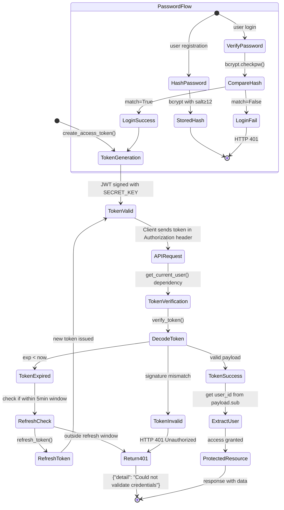

# UX 设计 — Implement JWT authentication middleware

> 所属需求：后端 API 服务搭建

## 交互流程图


```

## 组件线框说明

## Core Module Structure (app/core/security.py)

### 1. Configuration Section
```
[Environment Variables Block]
├─ JWT_SECRET_KEY (required, min 32 chars)
├─ JWT_ALGORITHM (default: HS256)
├─ ACCESS_TOKEN_EXPIRE_MINUTES (default: 30)
└─ BCRYPT_SALT_ROUNDS (default: 12)
```

### 2. Password Utilities
```
[hash_password() function]
├─ Input: plain_password (str)
├─ Process: bcrypt.hashpw() with salt
└─ Output: hashed_string (str)

[verify_password() function]
├─ Input: plain_password (str), hashed_password (str)
├─ Process: bcrypt.checkpw() with constant-time comparison
└─ Output: boolean (execution time ≥100ms)
```

### 3. JWT Token Management
```
[create_access_token() function]
├─ Input: data (dict), expires_delta (optional)
├─ Payload Construction:
│  ├─ sub: user_id
│  ├─ exp: current_time + ACCESS_TOKEN_EXPIRE_MINUTES
│  └─ iat: current_time
├─ Process: jwt.encode() with SECRET_KEY
└─ Output: token (str)

[verify_token() function]
├─ Input: token (str)
├─ Process: jwt.decode() with algorithm validation
├─ Error Handling:
│  ├─ ExpiredSignatureError → HTTP 401
│  ├─ JWTError → HTTP 401
│  └─ Invalid payload → HTTP 401
└─ Output: decoded_payload (dict)

[refresh_token() function]
├─ Input: token (str)
├─ Validation:
│  ├─ Check exp - now ≤ 5 minutes
│  └─ Verify token signature
├─ Process: create_access_token() with same payload
└─ Output: new_token (str) or HTTP 401
```

### 4. Authentication Dependency
```
[oauth2_scheme]
├─ Type: OAuth2PasswordBearer
└─ tokenUrl: "/auth/login"

[get_current_user() dependency]
├─ Input: token (str) from Authorization header
├─ Process:
│  ├─ verify_token(token)
│  ├─ Extract user_id from payload.sub
│  └─ Optional: query user from database
├─ Error Response:
│  └─ HTTP 401: {"detail": "Could not validate credentials"}
└─ Output: user_data (dict/object)
```

### 5. Error Response Structure
```
[HTTPException Format]
├─ status_code: 401
├─ detail: string (error message)
└─ headers: {"WWW-Authenticate": "Bearer"}
```

## 交互状态定义

## Function-Level States

### create_access_token()
- **Normal**: Returns valid JWT string with correct expiration time
- **Missing SECRET_KEY**: Raises ValueError("JWT_SECRET_KEY not configured")
- **Invalid expires_delta**: Uses default ACCESS_TOKEN_EXPIRE_MINUTES
- **Empty data dict**: Creates token with only exp/iat claims

### verify_token()
- **Valid Token**: Returns decoded payload dict with sub/exp/iat
- **Expired Token**: Raises HTTPException(401, "Token has expired")
- **Invalid Signature**: Raises HTTPException(401, "Invalid token signature")
- **Malformed Token**: Raises HTTPException(401, "Could not validate credentials")
- **Missing Claims**: Raises HTTPException(401, "Token missing required claims")

### refresh_token()
- **Within Refresh Window**: Returns new token with extended expiration
- **Outside Refresh Window**: Raises HTTPException(401, "Token expired, please login again")
- **Invalid Token**: Raises HTTPException(401, "Cannot refresh invalid token")
- **Already Refreshed**: Prevents token reuse (optional: implement token blacklist)

### hash_password()
- **Normal**: Returns bcrypt hashed string (60 chars)
- **Empty Password**: Raises ValueError("Password cannot be empty")
- **Weak Password**: (Optional) Raises ValueError("Password too weak") if length < 8
- **Hashing Error**: Logs error and raises RuntimeError("Password hashing failed")

### verify_password()
- **Match**: Returns True after ≥100ms execution time
- **Mismatch**: Returns False after ≥100ms execution time (constant-time)
- **Invalid Hash Format**: Returns False (graceful degradation)
- **Empty Input**: Returns False

### get_current_user()
- **Authenticated**: Returns user object/dict with id, email, roles
- **Missing Token**: Raises HTTPException(401, "Not authenticated")
- **Invalid Token**: Raises HTTPException(401, "Could not validate credentials")
- **User Not Found**: Raises HTTPException(401, "User no longer exists")
- **Disabled User**: Raises HTTPException(403, "User account disabled")

## Environment Variable States

### JWT_SECRET_KEY
- **Valid**: Length ≥ 32 characters, loaded successfully
- **Missing**: Raises ValueError on module import
- **Too Short**: Raises ValueError("SECRET_KEY must be at least 32 characters")
- **Exposed in Logs**: Never logged or printed

### ACCESS_TOKEN_EXPIRE_MINUTES
- **Valid**: Integer between 5-1440 (5 min to 24 hours)
- **Missing**: Uses default value 30
- **Invalid Type**: Converts to int or uses default
- **Out of Range**: Clamps to min/max values

## Security States

### Token Lifecycle
- **Fresh**: Just created, full validity period remaining
- **Active**: Valid and within expiration time
- **Near Expiry**: Within 5-minute refresh window
- **Expired**: Past expiration time, requires re-login
- **Revoked**: (Optional) In blacklist, permanently invalid

### Password Comparison
- **Timing-Safe**: Always takes ≥100ms regardless of match result
- **Constant-Time**: Uses bcrypt's built-in constant-time comparison
- **No Early Return**: Completes full hash comparison even on mismatch

## 响应式/适配规则

## Platform-Agnostic Rules (Backend Middleware)

This is a backend authentication middleware with no direct UI, but the following rules apply to API responses and integration:

### API Response Format (All Devices)
- **Token Response**: Always JSON with consistent structure
  ```json
  {
    "access_token": "eyJ...",
    "token_type": "bearer",
    "expires_in": 1800
  }
  ```
- **Error Response**: Consistent format across all endpoints
  ```json
  {
    "detail": "Could not validate credentials",
    "error_code": "INVALID_TOKEN"
  }
  ```

### Token Size Considerations
- **Mobile (< 768px)**: Token payload should be minimal (< 512 bytes) to reduce bandwidth
- **Desktop (> 1024px)**: Can include additional claims (roles, permissions) up to 2KB
- **All Platforms**: Avoid embedding large objects in JWT payload

### Header Requirements
- **Authorization Header**: `Bearer <token>` format (case-insensitive)
- **WWW-Authenticate Header**: Included in 401 responses for OAuth2 compliance
- **Content-Type**: Always `application/json` for auth endpoints

### Rate Limiting (Device-Agnostic)
- **Token Generation**: Max 5 requests/minute per IP
- **Token Refresh**: Max 10 requests/minute per user
- **Password Verification**: Max 3 failed attempts per 5 minutes per user (防暴力破解)

### CORS Configuration
- **Mobile Apps**: Allow credentials, specific origins only
- **Web (All Breakpoints)**: 
  - Allow-Origin: Whitelist only (no wildcard with credentials)
  - Allow-Headers: Authorization, Content-Type
  - Allow-Methods: POST, GET (auth endpoints)

### Token Storage Recommendations (Client-Side)
- **Mobile Native Apps**: Secure keychain/keystore
- **Web Desktop**: HttpOnly cookie (preferred) or sessionStorage
- **Web Mobile**: HttpOnly cookie only (no localStorage due to XSS risk)

### Timeout Configuration
- **Mobile Networks**: Extend token expiration to 60 minutes (poor connectivity)
- **Desktop/Stable Networks**: Standard 30 minutes
- **Refresh Window**: Always 5 minutes before expiration (all platforms)

### Error Handling by Platform
- **Mobile**: Return concise error messages (save bandwidth)
- **Desktop**: Can include detailed error descriptions
- **All**: Never expose stack traces or internal error details

### Performance Targets
- **Token Generation**: < 50ms (all platforms)
- **Token Verification**: < 20ms (all platforms)
- **Password Hashing**: 100-200ms (acceptable on all devices)
- **Password Verification**: ≥ 100ms (security requirement, all platforms)

## UI 资产清单（初稿）

## Icons (Not Applicable - Backend Service)
No icons required for backend authentication middleware.

## Illustrations (Not Applicable)
No illustrations required for backend authentication middleware.

## Images (Not Applicable)
No images required for backend authentication middleware.

## Code Assets (Required)

### Cryptographic Keys
- **asset**: JWT_SECRET_KEY
  - **type**: Environment variable (string)
  - **requirements**: 
    - Length ≥ 32 characters
    - Cryptographically random (use `secrets.token_urlsafe(32)`)
    - Never committed to version control
  - **storage**: `.env` file (must be in `.gitignore`)
  - **example**: `JWT_SECRET_KEY=your-secret-key-min-32-chars-long-random-string`

### Configuration Files
- **asset**: `.env.example`
  - **type**: Template file
  - **content**:
    ```
    JWT_SECRET_KEY=change-me-to-random-32-char-string
    JWT_ALGORITHM=HS256
    ACCESS_TOKEN_EXPIRE_MINUTES=30
    BCRYPT_SALT_ROUNDS=12
    ```
  - **purpose**: Guide developers to set up environment variables

### Python Dependencies
- **asset**: requirements.txt entries
  - **required packages**:
    ```
    PyJWT>=2.8.0
    bcrypt>=4.1.0
    python-jose[cryptography]>=3.3.0  # alternative to PyJWT
    passlib[bcrypt]>=1.7.4  # password hashing utilities
    python-multipart>=0.0.6  # for OAuth2PasswordBearer
    ```

### Test Fixtures
- **asset**: Mock JWT tokens for testing
  - **type**: JSON files in `tests/fixtures/`
  - **examples**:
    - `valid_token.json`: Valid token with future expiration
    - `expired_token.json`: Token with past expiration
    - `invalid_signature_token.json`: Token with wrong signature
    - `malformed_token.json`: Corrupted token string

### Documentation Assets
- **asset**: API documentation snippets
  - **type**: Markdown/OpenAPI spec
  - **content**: Example curl commands for token generation/verification
  - **example**:
    ```bash
    curl -X POST "http://localhost:8000/auth/login" \
      -H "Content-Type: application/json" \
      -d '{"username":"user","password":"pass"}'
    ```

### Error Message Templates
- **asset**: `error_messages.py` (optional)
  - **type**: Python constants
  - **content**:
    ```python
    TOKEN_EXPIRED = "Token has expired"
    INVALID_TOKEN = "Could not validate credentials"
    MISSING_SECRET = "JWT_SECRET_KEY not configured"
    WEAK_PASSWORD = "Password does not meet security requirements"
    ```

## Security Assets (Critical)

### .gitignore Entries (Must Have)
```
.env
.env.*
!.env.example
*.pem
*.key
secrets/
credentials/
```

### Pre-commit Hooks (Recommended)
- **asset**: `.pre-commit-config.yaml`
  - **purpose**: Prevent committing secrets
  - **tools**: detect-secrets, gitleaks

## No Visual Assets Required
This is a backend authentication middleware with no user-facing UI components. All "assets" are code, configuration, or cryptographic materials.
