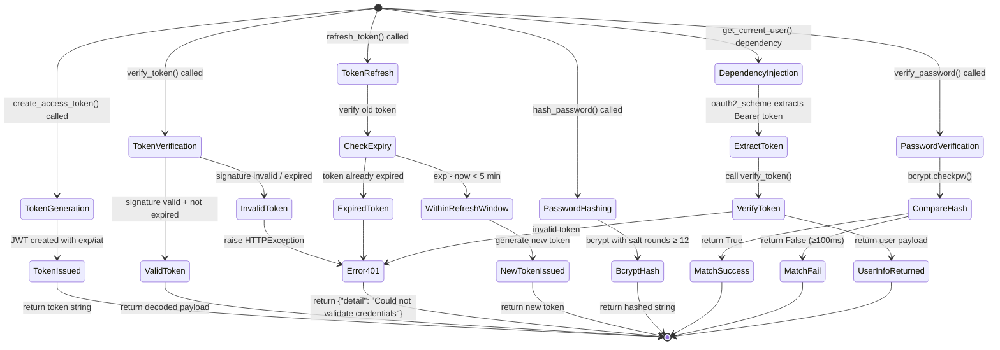

# UX 设计 — Implement JWT authentication middleware

> 所属需求：后端 API 服务搭建

## 交互流程图


```

## 组件线框说明

## Core Module Structure (app/core/security.py)

### 1. Configuration Section
```
[Environment Variables]
├─ JWT_SECRET_KEY (required, min 32 chars)
├─ JWT_ALGORITHM (default: HS256)
├─ ACCESS_TOKEN_EXPIRE_MINUTES (default: 30)
└─ BCRYPT_SALT_ROUNDS (default: 12)
```

### 2. Password Utilities
```
[hash_password function]
├─ Input: plain_password (str)
├─ Process: bcrypt.hashpw() with salt rounds
└─ Output: hashed_password (str)

[verify_password function]
├─ Input: plain_password (str), hashed_password (str)
├─ Process: bcrypt.checkpw() with timing protection
└─ Output: is_valid (bool)
```

### 3. JWT Token Management
```
[create_access_token function]
├─ Input: data (dict), expires_delta (Optional[timedelta])
├─ Process:
│  ├─ Add 'sub' field (user identifier)
│  ├─ Add 'exp' field (expiration timestamp)
│  ├─ Add 'iat' field (issued at timestamp)
│  └─ Encode with JWT_SECRET_KEY + JWT_ALGORITHM
└─ Output: token (str)

[verify_token function]
├─ Input: token (str)
├─ Process:
│  ├─ Decode JWT with secret key
│  ├─ Validate signature
│  ├─ Check expiration time
│  └─ Extract payload
├─ Success: return payload (dict)
└─ Failure: raise HTTPException(401, "Could not validate credentials")

[refresh_token function]
├─ Input: token (str)
├─ Process:
│  ├─ Verify old token
│  ├─ Check if within refresh window (exp - now < 5 min)
│  ├─ Extract user data from payload
│  └─ Generate new token with extended expiration
├─ Success: return new_token (str)
└─ Failure: raise HTTPException(401, "Token expired or invalid")
```

### 4. Authentication Dependency
```
[oauth2_scheme]
├─ Type: OAuth2PasswordBearer
├─ tokenUrl: "/auth/login"
└─ Auto-extract Bearer token from Authorization header

[get_current_user dependency]
├─ Input: token (str) from oauth2_scheme
├─ Process:
│  ├─ Call verify_token(token)
│  ├─ Extract user_id from payload['sub']
│  └─ Return user info (dict)
├─ Success: return current_user (dict)
└─ Failure: raise HTTPException(401, "Invalid authentication credentials")
```

### 5. Error Response Structure
```
[401 Unauthorized Response]
{
  "detail": "Could not validate credentials",
  "headers": {"WWW-Authenticate": "Bearer"}
}

[403 Forbidden Response]
{
  "detail": "Insufficient permissions"
}
```

## 交互状态定义

## Function-Level States

### create_access_token()
- **Normal**: Receives valid data dict → returns JWT string
- **Invalid Input**: Missing 'sub' field → raises ValueError
- **Config Error**: JWT_SECRET_KEY not set → raises ValueError("JWT_SECRET_KEY must be configured")
- **Config Error**: JWT_SECRET_KEY length < 32 → raises ValueError("JWT_SECRET_KEY must be at least 32 characters")

### verify_token()
- **Valid Token**: Signature valid + not expired → returns payload dict
- **Expired Token**: exp < current time → raises HTTPException(401, "Token has expired")
- **Invalid Signature**: Tampered token → raises HTTPException(401, "Invalid token signature")
- **Malformed Token**: Not a valid JWT → raises HTTPException(401, "Could not validate credentials")
- **Missing Claims**: No 'sub' or 'exp' field → raises HTTPException(401, "Invalid token payload")

### refresh_token()
- **Within Refresh Window**: exp - now < 5 min → returns new token
- **Outside Refresh Window**: exp - now ≥ 5 min → raises HTTPException(400, "Token not eligible for refresh yet")
- **Expired Token**: Token already expired → raises HTTPException(401, "Token has expired")
- **Invalid Token**: Verification fails → raises HTTPException(401, "Invalid token")

### hash_password()
- **Normal**: Plain password → returns bcrypt hash string
- **Empty Password**: password = "" → raises ValueError("Password cannot be empty")
- **Hashing Error**: bcrypt failure → raises RuntimeError("Password hashing failed")

### verify_password()
- **Match**: Plain matches hashed → returns True (execution time ≥ 100ms)
- **Mismatch**: Plain doesn't match → returns False (execution time ≥ 100ms, constant-time comparison)
- **Invalid Hash**: Malformed hash string → returns False
- **Empty Input**: plain or hashed is empty → returns False

### get_current_user()
- **Authenticated**: Valid token → returns user dict {"user_id": str, "username": str, ...}
- **No Token**: Authorization header missing → raises HTTPException(401, "Not authenticated")
- **Invalid Token**: Token verification fails → raises HTTPException(401, "Invalid authentication credentials")
- **Malformed Header**: Not "Bearer <token>" format → raises HTTPException(401, "Invalid authorization header format")

## Environment Variable States

### JWT_SECRET_KEY
- **Not Set**: raises ValueError on module import
- **Too Short**: length < 32 → raises ValueError on module import
- **Valid**: length ≥ 32 → normal operation

### ACCESS_TOKEN_EXPIRE_MINUTES
- **Not Set**: defaults to 30 minutes
- **Invalid Value**: non-numeric → raises ValueError
- **Valid**: numeric value → used for token expiration

## Security States

### Timing Attack Protection
- **Password Verification**: Always takes ≥ 100ms regardless of match result
- **Token Verification**: Constant-time string comparison for signatures

### Token Lifecycle
- **Fresh**: iat ≤ now < exp - 5min → normal use
- **Near Expiry**: exp - 5min ≤ now < exp → eligible for refresh
- **Expired**: now ≥ exp → rejected with 401
- **Future Token**: iat > now + 60s → rejected as invalid (clock skew tolerance)

## 响应式/适配规则

## Platform Compatibility

### Backend Service (No UI)
This is a backend authentication middleware with no direct user interface. Responsive rules apply to API response behavior across different client types:

### Mobile Clients (< 768px)
- **Token Expiration**: Use shorter expiration time (15 min) for mobile apps due to frequent background state changes
- **Refresh Strategy**: Auto-refresh tokens when app returns to foreground if within refresh window
- **Error Messages**: Return concise error messages (max 100 chars) for mobile UI constraints

### Tablet Clients (768-1024px)
- **Token Expiration**: Standard 30 min expiration
- **Refresh Strategy**: Standard refresh logic (5 min before expiry)
- **Error Messages**: Standard detailed error messages

### Desktop Clients (> 1024px)
- **Token Expiration**: Extended expiration (60 min) for desktop web apps with persistent sessions
- **Refresh Strategy**: Proactive refresh at 50% token lifetime (30 min for 60 min token)
- **Error Messages**: Detailed error messages with troubleshooting hints

## API Response Format Consistency

### All Platforms
- **Success Response**: Always return `{"access_token": str, "token_type": "bearer", "expires_in": int}`
- **Error Response**: Always return `{"detail": str, "error_code": str}` with appropriate HTTP status
- **Content-Type**: Always `application/json`
- **CORS Headers**: Include for web clients (Origin, Methods, Headers)

## Rate Limiting by Client Type

### Mobile Apps
- **Login Attempts**: 5 per 15 min per device_id
- **Token Refresh**: 10 per hour per user

### Web Clients
- **Login Attempts**: 10 per 15 min per IP
- **Token Refresh**: 20 per hour per user

### API Clients (Server-to-Server)
- **Login Attempts**: 100 per 15 min per API key
- **Token Refresh**: Unlimited (use long-lived tokens instead)

## Token Payload Adaptation

### Mobile Clients
```json
{
  "sub": "user_id",
  "exp": 1234567890,
  "iat": 1234567000,
  "device_id": "mobile_device_uuid",
  "platform": "ios|android"
}
```

### Web Clients
```json
{
  "sub": "user_id",
  "exp": 1234567890,
  "iat": 1234567000,
  "session_id": "web_session_uuid",
  "ip_address": "client_ip"
}
```

### API Clients
```json
{
  "sub": "service_account_id",
  "exp": 1234567890,
  "iat": 1234567000,
  "api_key_id": "key_uuid",
  "scopes": ["read", "write"]
}
```

## UI 资产清单（初稿）

## Icons (Not Applicable)
This is a backend authentication middleware with no UI components. No icons required.

## Illustrations (Not Applicable)
No visual illustrations needed for backend service.

## Images (Not Applicable)
No images required for backend service.

## Documentation Assets

### Sequence Diagrams (for developer documentation)
- **diagram**: jwt-authentication-flow
  - **Purpose**: Illustrate token generation → verification → refresh lifecycle
  - **Format**: Mermaid sequence diagram
  - **Size**: Scalable vector (SVG export)
  - **Usage**: Include in API documentation and developer onboarding

- **diagram**: password-hashing-flow
  - **Purpose**: Show bcrypt hashing and verification process
  - **Format**: Mermaid flowchart
  - **Size**: Scalable vector (SVG export)
  - **Usage**: Security documentation

### Code Examples (for API documentation)
- **code-snippet**: token-generation-example
  - **Language**: Python
  - **Purpose**: Show how to call `create_access_token()`
  - **Format**: Syntax-highlighted code block

- **code-snippet**: protected-route-example
  - **Language**: Python (FastAPI)
  - **Purpose**: Demonstrate using `get_current_user` dependency
  - **Format**: Syntax-highlighted code block

- **code-snippet**: token-refresh-example
  - **Language**: Python
  - **Purpose**: Show token refresh implementation
  - **Format**: Syntax-highlighted code block

### Configuration Templates
- **file**: .env.example
  - **Purpose**: Template for required environment variables
  - **Content**:
    ```
    JWT_SECRET_KEY=your-secret-key-min-32-characters-long
    JWT_ALGORITHM=HS256
    ACCESS_TOKEN_EXPIRE_MINUTES=30
    BCRYPT_SALT_ROUNDS=12
    ```
  - **Usage**: Copy to `.env` and fill in actual values

## Testing Assets

### Mock Data
- **file**: test_tokens.json
  - **Purpose**: Sample valid/invalid/expired tokens for testing
  - **Format**: JSON array of token objects
  - **Usage**: Unit tests and integration tests

- **file**: test_users.json
  - **Purpose**: Sample user credentials (hashed passwords)
  - **Format**: JSON array of user objects
  - **Usage**: Authentication flow testing

## Security Assets

### Key Generation Script
- **script**: generate_secret_key.py
  - **Purpose**: Generate cryptographically secure JWT_SECRET_KEY
  - **Output**: 64-character random string
  - **Usage**: Run once during initial setup

## Logging Assets (for monitoring dashboards)

### Log Format Specification
- **document**: log-format-spec.md
  - **Purpose**: Define structured logging format for auth events
  - **Fields**: timestamp, event_type, user_id, ip_address, success/failure, error_code
  - **Usage**: Configure logging middleware and monitoring tools
