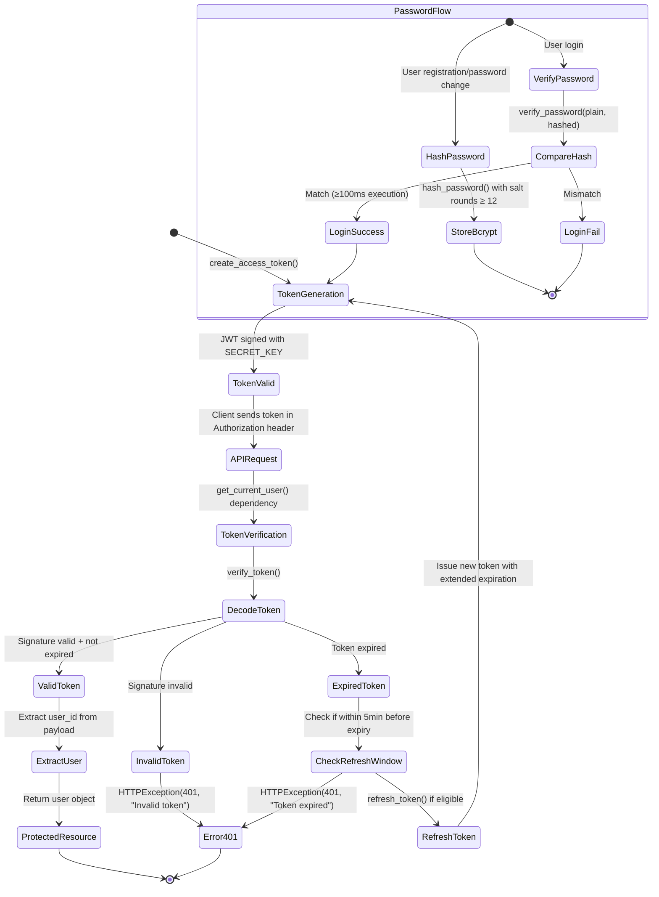

# UX 设计 — Implement JWT authentication middleware

> 所属需求：后端 API 服务搭建

## 交互流程图


```

## 组件线框说明

## Module Structure: app/core/security.py

### 1. Configuration Section
```
[Environment Variables]
├─ JWT_SECRET_KEY (required, min 32 chars)
├─ JWT_ALGORITHM (default: HS256)
├─ ACCESS_TOKEN_EXPIRE_MINUTES (default: 30)
└─ BCRYPT_SALT_ROUNDS (default: 12)
```

### 2. Password Utilities
```
[hash_password]
Input: plain_password (str)
Process: bcrypt.hashpw() with configured salt rounds
Output: hashed_string (str)

[verify_password]
Input: plain_password (str), hashed_password (str)
Process: bcrypt.checkpw() with timing attack protection
Output: boolean (execution time ≥ 100ms)
```

### 3. JWT Token Functions
```
[create_access_token]
Input: data (dict), expires_delta (Optional[timedelta])
Process:
  ├─ Copy input data
  ├─ Add 'exp' field (current time + expiration)
  ├─ Add 'iat' field (issued at timestamp)
  └─ Sign with jwt.encode(payload, SECRET_KEY, algorithm)
Output: token (str)

[verify_token]
Input: token (str)
Process:
  ├─ jwt.decode(token, SECRET_KEY, algorithms=[ALGORITHM])
  ├─ Validate signature
  ├─ Check expiration time
  └─ Verify required fields (sub, exp, iat)
Output: payload (dict) | raises HTTPException(401)

[refresh_token]
Input: token (str)
Process:
  ├─ Decode existing token
  ├─ Check if within 5min refresh window
  ├─ Extract user_id from 'sub' field
  └─ Call create_access_token() with same user data
Output: new_token (str) | raises HTTPException(401)
```

### 4. Authentication Dependency
```
[oauth2_scheme]
Type: OAuth2PasswordBearer
Token URL: /auth/login
Auto-extract: Authorization header (Bearer {token})

[get_current_user]
Input: token (str) = Depends(oauth2_scheme)
Process:
  ├─ Call verify_token(token)
  ├─ Extract user_id from payload['sub']
  ├─ (Optional) Query database for user object
  └─ Return user data
Output: User object | raises HTTPException(401)
Usage: Inject as dependency in protected routes
```

### 5. Error Response Structure
```
[401 Unauthorized]
{
  "detail": "Could not validate credentials" | "Token expired" | "Invalid token"
}

[403 Forbidden]
{
  "detail": "Insufficient permissions"
}

[500 Internal Server Error]
{
  "detail": "JWT_SECRET_KEY not configured" | "Invalid secret key length"
}
```

## 交互状态定义

## 1. create_access_token()
- **Normal**: Returns valid JWT string, payload includes {sub, exp, iat}
- **Custom Expiration**: Accepts expires_delta parameter, overrides default 30min
- **Missing Secret**: Raises ValueError if JWT_SECRET_KEY not set
- **Invalid Secret**: Raises ValueError if secret length < 32 characters
- **Encoding Error**: Raises JWTError if payload contains non-serializable data

## 2. verify_token()
- **Valid Token**: Returns decoded payload dict with all fields intact
- **Expired Token**: Raises HTTPException(status_code=401, detail="Token expired")
- **Invalid Signature**: Raises HTTPException(status_code=401, detail="Invalid token")
- **Malformed Token**: Raises HTTPException(status_code=401, detail="Could not validate credentials")
- **Missing Required Fields**: Raises HTTPException(status_code=401, detail="Invalid token payload")
- **Algorithm Mismatch**: Raises HTTPException(status_code=401, detail="Invalid token algorithm")

## 3. refresh_token()
- **Eligible for Refresh**: Token expires within 5 minutes, returns new token with extended expiration
- **Too Early**: Token has >5min remaining, raises HTTPException(status_code=400, detail="Token not eligible for refresh")
- **Already Expired**: Token expired >5min ago, raises HTTPException(status_code=401, detail="Token expired, please login again")
- **Invalid Token**: Delegates to verify_token() error states

## 4. hash_password()
- **Normal**: Returns bcrypt hashed string (60 chars, starts with $2b$)
- **Empty Password**: Raises ValueError("Password cannot be empty")
- **Hashing Error**: Raises RuntimeError if bcrypt fails (rare, system issue)
- **Performance**: Execution time 100-300ms depending on salt rounds

## 5. verify_password()
- **Match**: Returns True after ≥100ms execution (constant time)
- **Mismatch**: Returns False after ≥100ms execution (constant time)
- **Invalid Hash Format**: Returns False (graceful degradation)
- **Empty Input**: Returns False immediately
- **Timing Attack Protection**: Uses bcrypt.checkpw() constant-time comparison

## 6. get_current_user()
- **Authenticated**: Returns user object with id, email, roles
- **Missing Token**: Raises HTTPException(status_code=401, detail="Not authenticated") - auto-handled by OAuth2PasswordBearer
- **Invalid Token**: Delegates to verify_token() error states
- **User Not Found**: Raises HTTPException(status_code=401, detail="User not found") - if database lookup fails
- **Inactive User**: Raises HTTPException(status_code=403, detail="Inactive user") - if user.is_active == False

## 7. Environment Variable Loading
- **All Variables Set**: Module initializes successfully
- **JWT_SECRET_KEY Missing**: Raises ValueError("JWT_SECRET_KEY environment variable not set")
- **JWT_SECRET_KEY Too Short**: Raises ValueError("JWT_SECRET_KEY must be at least 32 characters")
- **Invalid Algorithm**: Defaults to HS256, logs warning if unsupported algorithm specified
- **Invalid Expiration Time**: Defaults to 30 minutes, logs warning if non-numeric value provided

## 8. OAuth2PasswordBearer Scheme
- **Token Present**: Extracts token from Authorization: Bearer {token} header
- **Token Missing**: Raises HTTPException(status_code=401, detail="Not authenticated")
- **Invalid Header Format**: Raises HTTPException(status_code=401, detail="Invalid authentication credentials")
- **Multiple Tokens**: Uses first token, logs warning

## 响应式/适配规则

## Platform: Backend API Module (No UI)

This component is a **server-side authentication middleware** with no user interface. Responsive design rules do not apply.

### API Response Format (All Devices)
- **Content-Type**: application/json
- **Status Codes**:
  - 200: Successful token generation/refresh
  - 401: Authentication failed (invalid/expired token)
  - 403: Insufficient permissions
  - 500: Server configuration error

### Token Payload Structure (Device-Agnostic)
```json
{
  "sub": "user_id_string",
  "exp": 1234567890,
  "iat": 1234567800
}
```

### Error Response Structure (Consistent Across All Clients)
```json
{
  "detail": "Error message string"
}
```

### Performance Targets (Network-Independent)
- Token generation: < 50ms
- Token verification: < 20ms
- Password hashing: 100-300ms (intentionally slow for security)
- Password verification: ≥ 100ms (constant time)

### Security Headers (All HTTP Responses)
- `WWW-Authenticate: Bearer` (for 401 responses)
- No CORS restrictions defined at middleware level (handled by app config)

### Client Integration Notes
- **Mobile Apps**: Store token in secure storage (Keychain/Keystore), send in Authorization header
- **Web Apps**: Store token in httpOnly cookie or localStorage, include in fetch/axios headers
- **Desktop Apps**: Store token in encrypted local config, refresh before expiration

**No breakpoints or viewport-specific logic required** - this is pure backend logic.

## UI 资产清单（初稿）

## UI Assets: None Required

**Rationale**: This is a backend authentication middleware module with no user-facing interface. All interactions occur programmatically through API calls.

---

## Documentation Assets (Optional, for Developer Portal)

If creating API documentation UI (e.g., Swagger/ReDoc), the following assets may be needed:

### Icons
- **icon**: lock-closed (authentication endpoint indicator, 20px, outline style)
- **icon**: key (JWT token representation, 20px, outline style)
- **icon**: shield-check (security feature badge, 24px, solid style)
- **icon**: refresh (token refresh action, 20px, outline style)
- **icon**: alert-circle (error state indicator, 20px, outline style)

### Diagrams
- **diagram**: jwt-flow (sequence diagram showing token generation → validation → refresh, 800x600, SVG format)
- **diagram**: password-hash-flow (flowchart showing bcrypt hashing process, 600x400, SVG format)

### Code Examples (Syntax-Highlighted Blocks)
- **code-snippet**: token-generation-example (Python code showing create_access_token() usage, 600px width)
- **code-snippet**: protected-route-example (FastAPI route with get_current_user dependency, 600px width)
- **code-snippet**: password-hash-example (Python code showing hash_password() and verify_password() usage, 600px width)

### Status Badges
- **badge**: security-level-high (green badge with shield icon, 120x30)
- **badge**: bcrypt-enabled (blue badge, 100x30)
- **badge**: jwt-compliant (blue badge, 100x30)

---

## Error State Illustrations (If Building Admin Dashboard)

### Illustrations
- **illustration**: invalid-token (broken key icon with red cross, 200x200, for 401 error pages)
- **illustration**: token-expired (hourglass icon, 200x200, for token expiration notices)
- **illustration**: config-error (wrench with alert symbol, 200x200, for JWT_SECRET_KEY missing errors)

### Placeholder Images
- **image**: security-banner (abstract lock/shield graphic, 1200x400, for authentication documentation header)

---

**Note**: If this module is purely backend with no admin UI, all assets listed above are **NOT REQUIRED** for implementation. Only include if building accompanying documentation or monitoring dashboards.
