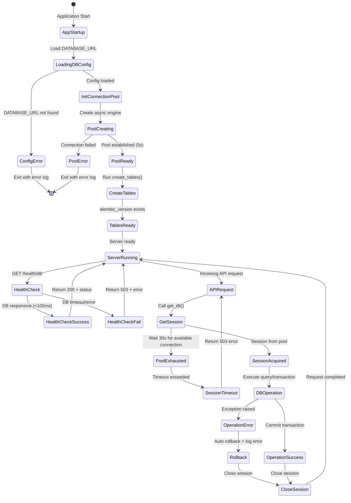

# UX 设计 — Setup database connection pool and base model

> 所属需求：后端 API 服务搭建

## 交互流程图


```

## 组件线框说明

## 系统架构组件结构

### 1. Database Configuration Module (app/core/database.py)
- **Environment Loader**
  - DATABASE_URL reader (from os.environ)
  - Validation logic (raise error if missing)
  - Connection string parser

- **Engine Factory**
  - AsyncEngine instance
  - Connection pool config:
    - pool_size: 10
    - max_overflow: 20
    - pool_timeout: 30s
  - Echo mode (SQL logging for dev)

- **Session Factory**
  - AsyncSessionLocal (sessionmaker)
  - Async context manager support

### 2. Base Model (app/models/base.py)
- **Base Class (DeclarativeBase)**
  - Common fields:
    - id: UUID (primary_key, default=uuid4)
    - created_at: DateTime (default=now, timezone=True)
    - updated_at: DateTime (onupdate=now, timezone=True)
  - __repr__() method: "<ModelName(id=xxx)>"
  - __tablename__ auto-generation (snake_case)

### 3. Dependency Injection (app/core/dependencies.py)
- **get_db() Function**
  - Async generator
  - Yields AsyncSession
  - Auto-close on request end
  - Exception handling wrapper

### 4. Database Initialization (app/core/init_db.py)
- **create_tables() Function**
  - Create all tables from Base.metadata
  - Create alembic_version table
  - Idempotent execution (skip if exists)

### 5. Health Check Endpoint (app/api/health.py)
- **GET /health/db Route**
  - Response structure:
    - Success: {"status": "healthy", "response_time_ms": <number>}
    - Failure: {"status": "unhealthy", "error": "<message>"}
  - Status codes:
    - 200: DB responsive
    - 503: DB unavailable

### 6. Application Startup (app/main.py)
- **Lifespan Event Handler**
  - Load DATABASE_URL
  - Initialize connection pool
  - Run create_tables()
  - Log startup status

### 7. Logging Module (app/core/logging.py)
- **Logger Configuration**
  - Log levels: DEBUG / INFO / WARNING / ERROR
  - Format: timestamp + level + module + message
  - Output: console (dev) / file (prod)

## 交互状态定义

## Component Interaction States

### Database Connection Pool
- **initializing**: Engine creation in progress, no connections available
- **ready**: Pool established, connections available (≥5 active)
- **degraded**: Some connections failed, pool size < expected
- **exhausted**: All connections in use, new requests queued (max 30s wait)
- **error**: Connection failed, pool unavailable

### Database Session (get_db dependency)
- **acquiring**: Waiting for available connection from pool
- **active**: Session acquired, transaction in progress
- **committing**: Transaction commit in progress
- **rolling_back**: Exception occurred, rollback in progress
- **closed**: Session returned to pool
- **timeout**: Failed to acquire session within 30s

### Health Check Endpoint (/health/db)
- **checking**: Executing test query (SELECT 1)
- **healthy**: Query completed <100ms, return 200
- **slow**: Query completed 100-1000ms, return 200 with warning log
- **unhealthy**: Query timeout/error, return 503
- **unavailable**: Connection pool not initialized, return 503

### Base Model Operations
- **creating**: INSERT operation, created_at set
- **reading**: SELECT operation, no state change
- **updating**: UPDATE operation, updated_at auto-refreshed
- **deleting**: DELETE operation (soft delete if implemented)
- **error**: Operation failed, transaction rolled back, error logged

### Application Startup
- **loading_config**: Reading DATABASE_URL from environment
- **config_missing**: DATABASE_URL not found, log error and exit
- **connecting**: Establishing connection pool
- **connection_failed**: Database unreachable, log error and exit
- **initializing_tables**: Running create_tables()
- **ready**: All checks passed, server accepting requests

### Transaction States
- **begin**: Transaction started
- **executing**: Query/command execution
- **success**: Operation completed, ready to commit
- **error**: Exception raised, auto-rollback triggered
- **committed**: Changes persisted to database
- **rolled_back**: Changes discarded, session clean

### Logging States
- **debug**: SQL queries logged (dev mode only)
- **info**: Startup events, health check results
- **warning**: Slow queries (>100ms), pool exhaustion warnings
- **error**: Connection failures, transaction rollbacks, exceptions

## 响应式/适配规则

## Responsive Rules (Backend Service - No UI)

### Connection Pool Scaling
- **Low Load** (<10 concurrent requests):
  - Active connections: 5-10
  - Idle connections: 5
  - Response time: <50ms

- **Medium Load** (10-20 concurrent requests):
  - Active connections: 10-20
  - Pool utilization: 50-80%
  - Response time: <100ms

- **High Load** (20-30 concurrent requests):
  - Active connections: 20-30 (pool_size + max_overflow)
  - Pool utilization: 80-100%
  - Response time: <200ms
  - Warning logs triggered

- **Overload** (>30 concurrent requests):
  - Queue new requests (max wait 30s)
  - Return 503 if timeout
  - Error logs triggered

### Timeout Configuration
- **Connection Timeout**: 10s (initial connection establishment)
- **Query Timeout**: 30s (per query execution)
- **Pool Checkout Timeout**: 30s (waiting for available connection)
- **Health Check Timeout**: 5s (fail fast for monitoring)

### Resource Limits
- **Max Connections**: 30 (pool_size 10 + max_overflow 20)
- **Min Idle Connections**: 5
- **Connection Lifetime**: 3600s (1 hour, recycle stale connections)
- **Statement Cache Size**: 500 (SQLAlchemy default)

### Environment-Specific Config
- **Development**:
  - Echo SQL: True
  - Pool size: 5
  - Max overflow: 5
  - Log level: DEBUG

- **Staging**:
  - Echo SQL: False
  - Pool size: 10
  - Max overflow: 10
  - Log level: INFO

- **Production**:
  - Echo SQL: False
  - Pool size: 10
  - Max overflow: 20
  - Log level: WARNING
  - Connection encryption: Required

### Monitoring Thresholds
- **Health Check**:
  - Green: <100ms response
  - Yellow: 100-500ms response
  - Red: >500ms or error

- **Pool Utilization**:
  - Normal: <70%
  - Warning: 70-90%
  - Critical: >90%

- **Error Rate**:
  - Normal: <1% failed queries
  - Warning: 1-5% failed queries
  - Critical: >5% failed queries

## UI 资产清单（初稿）

## UI Asset List (Backend Service - Logging & Monitoring)

### Log Format Assets
- **log_format_template**: Structured log format string
  - Fields: timestamp (ISO8601), level, module, function, message, context
  - Example: "2024-01-15T10:30:45.123Z | INFO | app.core.database | init_pool | Connection pool established | {pool_size: 10}"

### Error Message Templates
- **error_msg_db_url_missing**: "DATABASE_URL not found in environment variables. Please set DATABASE_URL in .env file."
- **error_msg_connection_failed**: "Failed to connect to database: {error_detail}. Check DATABASE_URL and network connectivity."
- **error_msg_pool_exhausted**: "Connection pool exhausted. All {max_connections} connections in use. Request timeout after 30s."
- **error_msg_query_timeout**: "Query execution timeout after 30s: {query_preview}"
- **error_msg_transaction_rollback**: "Transaction rolled back due to error: {exception_type} - {exception_message}"

### Health Check Response Schemas
- **health_response_success**:
  ```json
  {
    "status": "healthy",
    "response_time_ms": 45,
    "pool_size": 10,
    "active_connections": 3,
    "timestamp": "2024-01-15T10:30:45.123Z"
  }
  ```

- **health_response_failure**:
  ```json
  {
    "status": "unhealthy",
    "error": "Connection timeout after 5s",
    "timestamp": "2024-01-15T10:30:45.123Z"
  }
  ```

### Monitoring Metrics (for observability tools)
- **metric_pool_size**: Gauge - Current connection pool size
- **metric_active_connections**: Gauge - Number of connections in use
- **metric_idle_connections**: Gauge - Number of idle connections
- **metric_query_duration**: Histogram - Query execution time distribution
- **metric_connection_errors**: Counter - Failed connection attempts
- **metric_transaction_rollbacks**: Counter - Number of rollbacks
- **metric_health_check_duration**: Histogram - Health check response time

### Documentation Assets
- **diagram_connection_lifecycle**: Mermaid diagram showing connection acquisition → use → release flow
- **diagram_error_handling**: Flowchart for exception handling and rollback logic
- **table_env_variables**: Markdown table listing all required environment variables
  - DATABASE_URL (required): PostgreSQL connection string
  - DB_POOL_SIZE (optional, default=10): Connection pool size
  - DB_MAX_OVERFLOW (optional, default=20): Max overflow connections
  - DB_ECHO (optional, default=false): Enable SQL query logging

### Code Comment Templates
- **comment_security_warning**: "# SECURITY: Never log DATABASE_URL or connection strings containing credentials"
- **comment_performance_note**: "# PERFORMANCE: Connection pool exhaustion indicates need for horizontal scaling"
- **comment_migration_todo**: "# TODO: Integrate Alembic migrations in separate task (see issue #XXX)"

### Example SQL Queries (for testing)
- **query_health_check**: "SELECT 1" (minimal query for liveness check)
- **query_table_exists**: "SELECT EXISTS (SELECT FROM information_schema.tables WHERE table_name = 'alembic_version')"
- **query_connection_count**: "SELECT count(*) FROM pg_stat_activity WHERE datname = current_database()"

### No Visual Assets Required
- This is a backend service with no user-facing UI
- All "assets" are code templates, log formats, and monitoring schemas
- Visual design (colors, fonts, icons) not applicable
