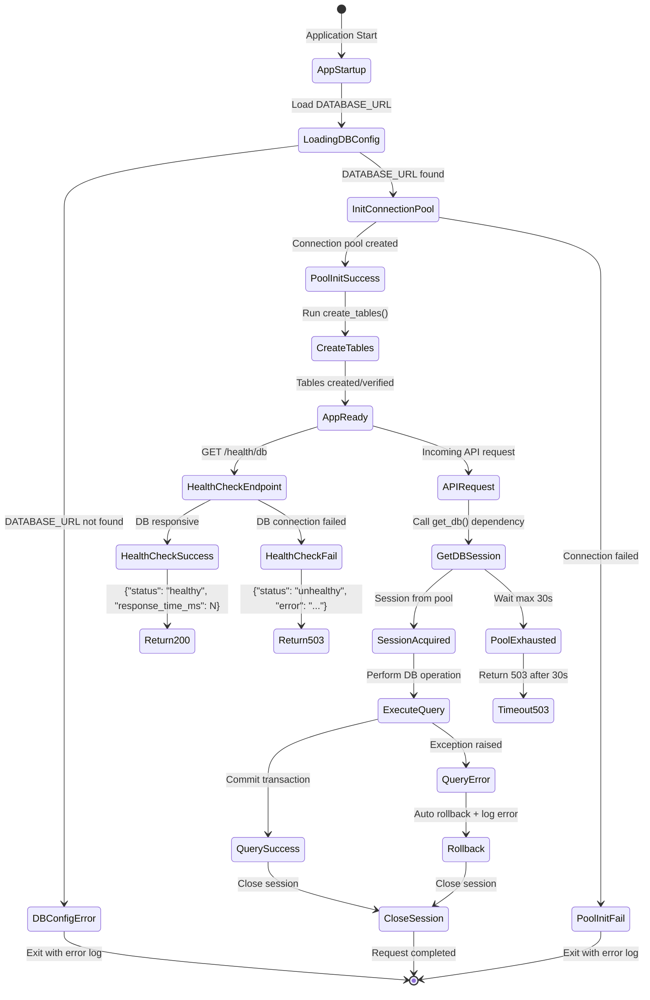

# UX 设计 — Setup database connection pool and base model

> 所属需求：后端 API 服务搭建

## 交互流程图


```

## 组件线框说明

## Database Layer Architecture (Non-visual Structure)

### 1. Configuration Module (app/core/config.py)
- **DatabaseSettings** class
  - Field: DATABASE_URL (from env)
  - Field: POOL_SIZE (default 10)
  - Field: MAX_OVERFLOW (default 20)
  - Field: POOL_TIMEOUT (default 30s)
  - Validation: Raise error if DATABASE_URL missing

### 2. Database Engine Module (app/db/session.py)
- **async_engine** instance
  - Connection pool configuration
  - asyncpg driver binding
- **async_session_maker** factory
  - Session lifecycle management
- **get_db()** dependency function
  - Yields session per request
  - Auto-close on request end
  - Exception handling with rollback

### 3. Base Model (app/models/base.py)
- **Base** class (SQLAlchemy DeclarativeBase)
  - Field: id (UUID, primary_key, default=uuid4)
  - Field: created_at (DateTime, default=utcnow)
  - Field: updated_at (DateTime, onupdate=utcnow)
  - Method: __repr__() → "<ModelName(id=xxx)>"
  - Mixin: Common query methods (optional)

### 4. Database Initialization (app/db/init_db.py)
- **create_tables()** async function
  - Create all tables from Base metadata
  - Create alembic_version table
  - Idempotent execution (safe to run multiple times)

### 5. Health Check Endpoint (app/api/health.py)
- **GET /health/db** route
  - Execute simple query (SELECT 1)
  - Measure response time
  - Return 200 + {status, response_time_ms} on success
  - Return 503 + {status, error} on failure

### 6. Application Startup (app/main.py)
- **lifespan** context manager
  - On startup: Initialize connection pool → create_tables()
  - On shutdown: Dispose engine
  - Error handling: Log and exit if init fails

## 交互状态定义

## Database Connection Pool States

### Connection Pool
- **initializing**: Engine creating connections (startup phase)
- **ready**: Pool has available connections (≥ 5 connections)
- **busy**: All connections in use, new requests queued
- **exhausted**: Pool + overflow full, requests waiting (max 30s)
- **timeout**: Request waited > 30s, return 503 error
- **disconnected**: Database unreachable, all operations fail
- **disposing**: Shutdown in progress, closing connections

### Database Session (per request)
- **created**: Session acquired from pool via get_db()
- **active**: Transaction in progress, executing queries
- **committing**: Transaction being committed
- **committed**: Transaction successfully committed
- **rolling_back**: Exception occurred, rolling back changes
- **rolled_back**: Transaction rolled back, error logged
- **closed**: Session returned to pool, resources released
- **error**: Session in error state, must rollback before close

### Health Check Endpoint States
- **checking**: Executing SELECT 1 query
- **healthy**: Query succeeded, response_time < 100ms
  - Response: 200 {"status": "healthy", "response_time_ms": N}
- **slow**: Query succeeded but response_time ≥ 100ms
  - Response: 200 {"status": "healthy", "response_time_ms": N} (still returns 200)
- **unhealthy**: Query failed or timeout
  - Response: 503 {"status": "unhealthy", "error": "<error_message>"}
- **timeout**: Health check exceeded internal timeout (e.g., 5s)
  - Response: 503 {"status": "unhealthy", "error": "Health check timeout"}

### Configuration Loading States
- **loading**: Reading DATABASE_URL from environment
- **loaded**: DATABASE_URL successfully retrieved
- **missing**: DATABASE_URL not found
  - Action: Log error "DATABASE_URL not found in environment variables" + exit
- **invalid**: DATABASE_URL format incorrect
  - Action: Log error with details + exit

### Base Model Instance States
- **new**: Model instance created, not yet persisted
- **pending**: Added to session, awaiting commit
- **persistent**: Committed to database, has id
- **detached**: Session closed, instance still in memory
- **deleted**: Marked for deletion, awaiting commit

## Error Handling States

### Transaction Error Flow
- **exception_raised**: Any database operation error
- **logging_error**: Writing error-level log entry
- **auto_rollback**: Automatic transaction rollback
- **session_cleanup**: Ensuring session is closed
- **error_propagated**: Re-raising exception to caller

### Startup Failure States
- **config_error**: DATABASE_URL missing/invalid → exit code 1
- **connection_error**: Cannot connect to database → exit code 1
- **table_creation_error**: create_tables() failed → exit code 1

## 响应式/适配规则

## Responsive Rules (API Service - Non-UI)

### Connection Pool Scaling
- **Low Load** (< 10 concurrent requests)
  - Active connections: 5-10
  - Overflow: 0
  - Response time: < 50ms

- **Medium Load** (10-20 concurrent requests)
  - Active connections: 10-20
  - Overflow: 0-10
  - Response time: 50-100ms

- **High Load** (20-30 concurrent requests)
  - Active connections: 20-30
  - Overflow: 10-20 (max_overflow reached)
  - Response time: 100-200ms
  - Warning: Log "Connection pool near capacity"

- **Overload** (> 30 concurrent requests)
  - Active connections: 30 (pool_size + max_overflow)
  - New requests: Queued, waiting up to 30s
  - Response time: > 200ms or timeout
  - Action: Return 503 after 30s timeout

### Database Query Timeout Rules
- **Simple queries** (SELECT by primary key): 100ms timeout
- **Complex queries** (JOIN, aggregation): 1s timeout
- **Batch operations**: 5s timeout
- **Health check**: 5s timeout

### Session Lifecycle Boundaries
- **Request scope**: One session per HTTP request
- **Auto-commit**: Disabled (explicit commit required)
- **Auto-rollback**: Enabled on exception
- **Session timeout**: Inherit from pool_timeout (30s)

### Logging Verbosity by Environment
- **Development**
  - Level: DEBUG
  - Log all SQL queries
  - Log connection pool stats every 10s

- **Staging**
  - Level: INFO
  - Log slow queries (> 100ms)
  - Log connection pool warnings

- **Production**
  - Level: WARNING
  - Log errors and critical issues only
  - Log connection pool exhaustion
  - No SQL query logging (security)

### Resource Limits
- **Max connections per instance**: 30 (pool_size + max_overflow)
- **Max session duration**: 30s (pool_timeout)
- **Max transaction duration**: 10s (application-level timeout)
- **Health check frequency**: Every 30s (monitoring system)

### Graceful Degradation
- **Database slow**: Continue serving requests, log warnings
- **Connection pool exhausted**: Queue requests, return 503 after timeout
- **Database unreachable**: Fail fast, return 503 immediately
- **Startup failure**: Exit application, log error for restart

## UI 资产清单（初稿）

## UI Asset List (Logging & Monitoring Context)

### Icons (for log visualization/monitoring dashboards)
- **icon**: database-check (health check success, 16px, solid style, green)
- **icon**: database-error (health check failure, 16px, solid style, red)
- **icon**: database-loading (connection initializing, 16px, animated spinner, blue)
- **icon**: alert-triangle (connection pool warning, 16px, outline style, yellow)
- **icon**: alert-circle (connection pool exhausted, 16px, solid style, red)
- **icon**: clock (timeout indicator, 16px, outline style, orange)
- **icon**: check-circle (transaction committed, 16px, solid style, green)
- **icon**: x-circle (transaction rolled back, 16px, solid style, red)

### Illustrations (for monitoring dashboard empty/error states)
- **illustration**: database-connected (dashboard shows healthy DB, 200x200, isometric style)
- **illustration**: database-disconnected (dashboard shows DB error, 200x200, isometric style, grayscale)
- **illustration**: no-metrics (no monitoring data available, 300x200, minimal line art)

### Diagrams (for documentation)
- **diagram**: connection-pool-architecture (shows pool_size, max_overflow, session lifecycle, 800x600, technical diagram)
- **diagram**: session-lifecycle-flow (request → get_db → query → commit/rollback → close, 600x400, flowchart)
- **diagram**: error-handling-flow (exception → rollback → log → close, 500x300, flowchart)

### Log Message Templates (structured logging)
- **log_template**: startup_success
  - Message: "Database connection pool initialized successfully"
  - Fields: {pool_size, max_overflow, database_url_masked, timestamp}
  
- **log_template**: startup_failure
  - Message: "Failed to initialize database connection pool"
  - Fields: {error_type, error_message, database_url_masked, timestamp}
  
- **log_template**: config_missing
  - Message: "DATABASE_URL not found in environment variables"
  - Fields: {timestamp, env_vars_checked}
  
- **log_template**: health_check_success
  - Message: "Database health check passed"
  - Fields: {response_time_ms, timestamp}
  
- **log_template**: health_check_failure
  - Message: "Database health check failed"
  - Fields: {error_message, timestamp}
  
- **log_template**: pool_exhausted
  - Message: "Connection pool exhausted, request queued"
  - Fields: {active_connections, queue_size, wait_time_ms, timestamp}
  
- **log_template**: transaction_rollback
  - Message: "Transaction rolled back due to error"
  - Fields: {error_type, error_message, session_id, timestamp}
  
- **log_template**: slow_query
  - Message: "Slow query detected"
  - Fields: {query_time_ms, query_hash, timestamp}

### Monitoring Metrics (for Grafana/Prometheus dashboards)
- **metric**: db_connection_pool_size (gauge, current active connections)
- **metric**: db_connection_pool_overflow (gauge, current overflow connections)
- **metric**: db_health_check_response_time (histogram, milliseconds)
- **metric**: db_health_check_failures_total (counter, cumulative failures)
- **metric**: db_session_duration (histogram, milliseconds per session)
- **metric**: db_transaction_rollbacks_total (counter, cumulative rollbacks)
- **metric**: db_query_duration (histogram, milliseconds per query)
- **metric**: db_pool_timeout_total (counter, cumulative timeout events)

### Documentation Assets
- **image**: env-file-example (screenshot of .env.example file, 600x400, PNG)
- **image**: alembic-version-table (screenshot of alembic_version table structure, 500x300, PNG)
- **code_snippet**: base-model-usage (example of inheriting from Base, markdown code block)
- **code_snippet**: get-db-dependency (example of using get_db() in FastAPI route, markdown code block)
