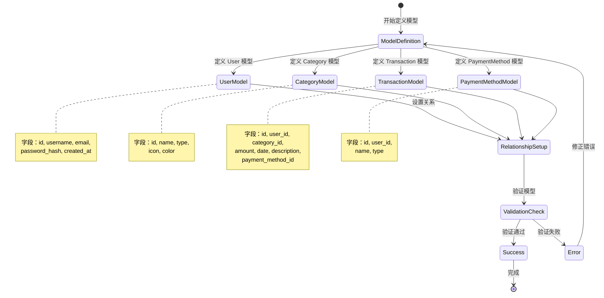

# UX 设计 — Define SQLAlchemy ORM models for core tables

> 所属需求：数据库设计与初始化

## 交互流程图



注：此为后端数据模型定义流程，无用户界面交互。
```

## 组件线框说明

## 组件结构说明

本工单为纯后端 ORM 模型定义，不涉及前端 UI 组件。

### 数据模型结构

**User 模型（用户表）**
- 主键区域：id (主键)
- 基础信息区域：username, email
- 安全信息区域：password_hash
- 时间戳区域：created_at, updated_at
- 关系区域：categories (一对多), payment_methods (一对多), transactions (一对多)

**Category 模型（分类表）**
- 主键区域：id (主键)
- 外键区域：user_id (外键)
- 基础信息区域：name, type (enum: income/expense)
- 显示属性区域：icon, color
- 时间戳区域：created_at, updated_at
- 关系区域：transactions (一对多), user (多对一)

**Transaction 模型（交易记录表）**
- 主键区域：id (主键)
- 外键区域：user_id, category_id, payment_method_id
- 交易信息区域：amount (decimal), date, description
- 时间戳区域：created_at, updated_at
- 关系区域：user (多对一), category (多对一), payment_method (多对一)

**PaymentMethod 模型（支付方式表）**
- 主键区域：id (主键)
- 外键区域：user_id (外键)
- 基础信息区域：name, type
- 时间戳区域：created_at, updated_at
- 关系区域：transactions (一对多), user (多对一)

### 模型关系图

```
User (1) ----< (N) Category
User (1) ----< (N) PaymentMethod
User (1) ----< (N) Transaction

Category (1) ----< (N) Transaction
PaymentMethod (1) ----< (N) Transaction
```

## 交互状态定义

## 交互状态说明

本工单为后端 ORM 模型定义，不涉及前端交互组件。

### 数据模型状态

**模型定义状态**
- [ ] 未定义（pending）：模型类尚未创建
- [ ] 定义中（defining）：正在编写模型字段和关系
- [ ] 待验证（validating）：模型定义完成，等待验证
- [ ] 验证失败（error）：字段类型、关系定义或约束存在错误
- [ ] 验证通过（success）：模型定义正确，可用于数据库迁移

**数据库迁移状态**
- [ ] 未迁移（not_migrated）：模型未同步到数据库
- [ ] 迁移中（migrating）：正在执行数据库迁移
- [ ] 迁移成功（migrated）：表结构已创建
- [ ] 迁移失败（migration_failed）：数据库同步失败

**数据记录状态（运行时）**
- [ ] 新建（new）：ORM 对象已创建但未持久化
- [ ] 持久化（persistent）：已保存到数据库
- [ ] 分离（detached）：对象已从 session 分离
- [ ] 删除（deleted）：标记为删除但未提交

### 字段验证状态

**必填字段（nullable=False）**
- [ ] 有值（filled）：字段已赋值
- [ ] 空值（null）：触发 IntegrityError

**唯一约束字段（unique=True）**
- [ ] 唯一（unique）：值在表中唯一
- [ ] 重复（duplicate）：触发 IntegrityError

**外键字段**
- [ ] 有效引用（valid）：外键指向存在的记录
- [ ] 无效引用（invalid）：外键指向不存在的记录，触发 ForeignKeyConstraint 错误
- [ ] 级联删除（cascade_delete）：父记录删除时子记录自动删除

## 响应式/适配规则

## 响应式规则

本工单为后端 ORM 模型定义，不涉及前端响应式布局。

### 数据库层面的「响应式」考虑

**字段长度适配**
- username: VARCHAR(50) - 适配常规用户名长度
- email: VARCHAR(120) - 适配标准邮箱格式
- password_hash: VARCHAR(255) - 适配 bcrypt/argon2 哈希长度
- description: TEXT - 适配任意长度描述文本
- name (Category/PaymentMethod): VARCHAR(50) - 适配分类/支付方式名称

**数值精度适配**
- amount (Transaction): DECIMAL(15, 2) - 支持最大 13 位整数 + 2 位小数，适配大额交易

**索引策略（性能响应）**
- user_id 外键字段：添加索引，加速关联查询
- email (User): 唯一索引，加速登录查询
- date (Transaction): 索引，加速按日期范围查询
- type (Category): 索引，加速按收入/支出类型筛选

**并发处理**
- created_at/updated_at: 使用数据库默认时间戳，避免应用层时区问题
- 乐观锁（可选）：添加 version 字段防止并发更新冲突

**数据量适配**
- Transaction 表：预期数据量最大，考虑分区策略（按年/月分区）
- 软删除（可选）：添加 is_deleted 字段而非物理删除，保留历史数据

## UI 资产清单（初稿）

## UI 资产清单

本工单为后端 ORM 模型定义，不涉及 UI 资产。

### 开发工具资产（非 UI）

**数据库可视化工具**
- tool: DB 设计工具（如 dbdiagram.io / draw.io）
  用途：绘制 ER 图，可视化表关系
  格式：PNG/SVG 导出

**代码编辑器插件**
- plugin: SQLAlchemy 语法高亮
  用途：提升模型定义代码可读性

**文档资产**
- document: 数据字典（Data Dictionary）
  用途：记录每个字段的业务含义、取值范围、示例值
  格式：Markdown 表格

### 未来前端开发可能需要的资产（参考）

**图标（icon）**
- icon: category-income（收入分类图标，24px，outline 风格）
- icon: category-expense（支出分类图标，24px，outline 风格）
- icon: payment-method（支付方式图标，24px，outline 风格）
- icon: transaction（交易记录图标，24px，outline 风格）

**插画（illustration）**
- illustration: empty-transactions（交易记录为空时显示，400x300）
- illustration: empty-categories（分类为空时显示，400x300）

注：以上前端资产不在本工单范围内，仅作为后续开发参考。
